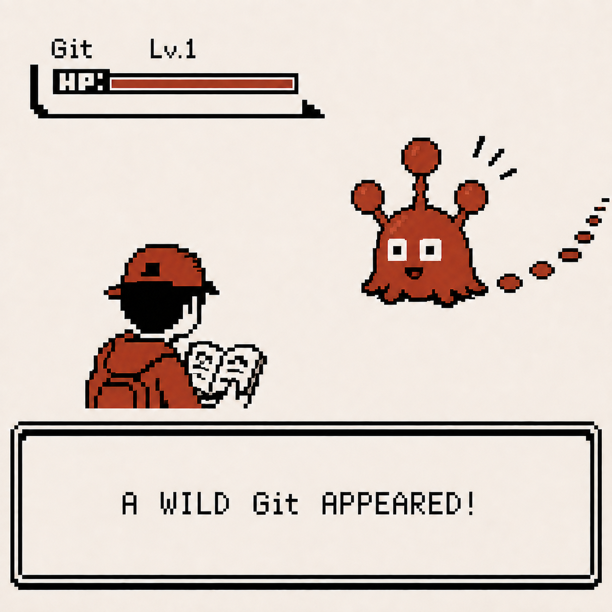
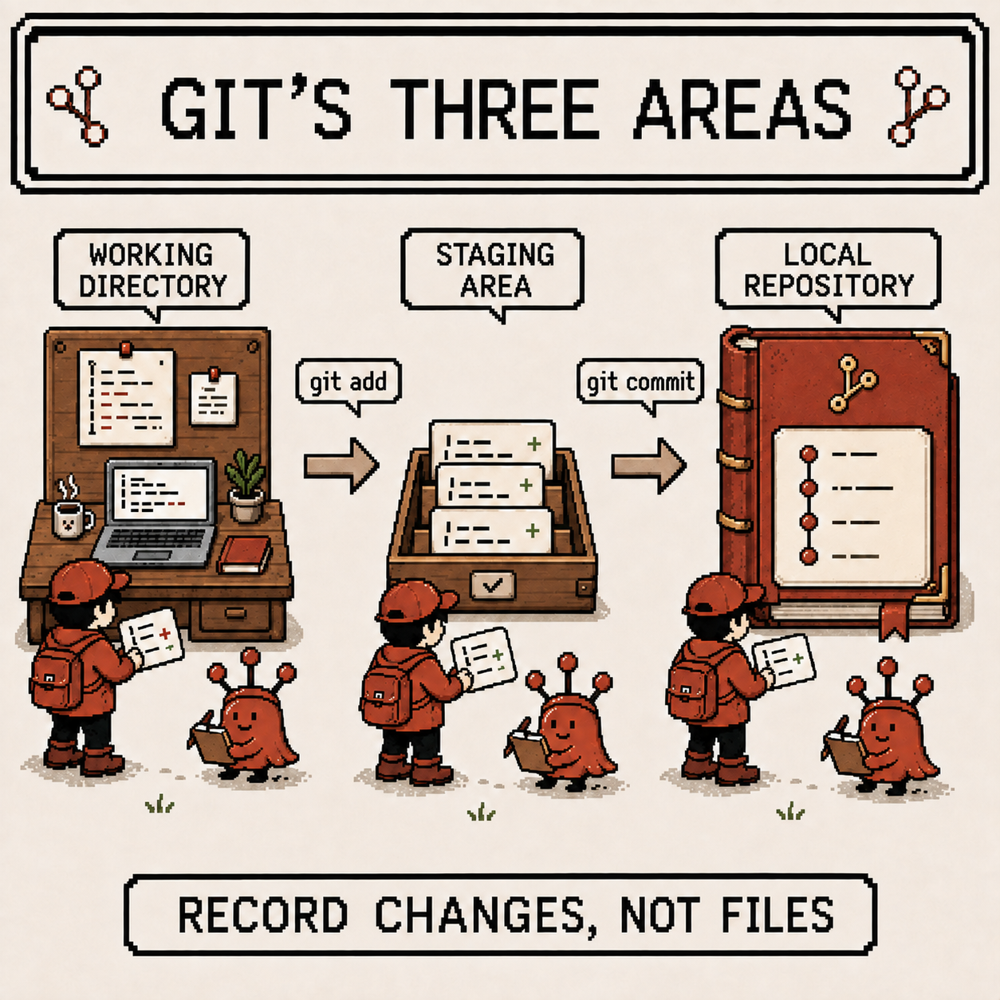
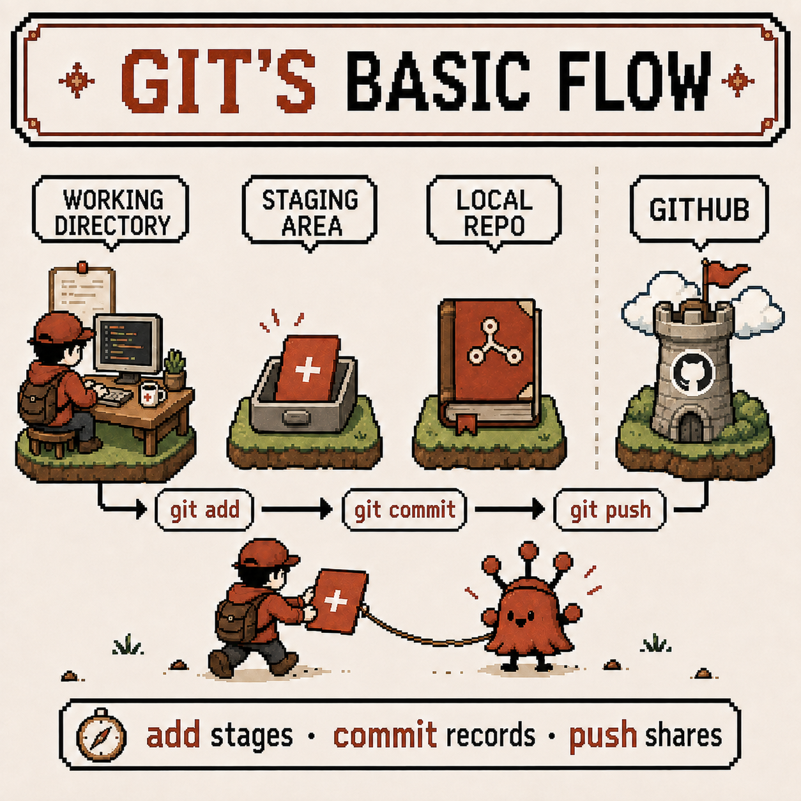
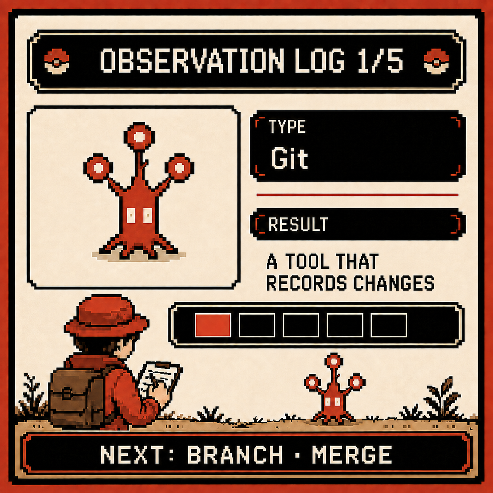

# Codigdex #01 — Starting the Codigdex

Every week, I discover, observe, and record a new specimen. This week's first encounter went like this.



When you're developing, moments like these keep coming up:
"I'm pretty sure I've seen this before…"
"How did I fix this last time?"

So I started this series.
Not a neatly organized textbook, but a dex — a field guide of things I've personally run into, recorded one by one.

I'm calling it **Codigdex**.
Languages, errors, concepts, tools, even the messy detours —
I want to discover, observe, and record the things I encounter while developing, one at a time.

The first specimen is **Git** —
pretty much the first thing anyone runs into once they start developing.

---

## Specimen info

- Name: Git
- Classification: Version control system
- Encounter rate: Very high
- Danger level: ⚠️ (use it without understanding it, and you will get burned)

---

## First impression

Honestly, my first impression of Git was something like this.

- Why are there so many commands?
- I ran `add`, so why didn't it go up?
- I ran `pull` and it just broke…?

I was just memorizing this sequence and running it:

```
git add .
git commit -m "message"
git push
```

I didn't really understand what I was doing.

---

## Observation 1 — Git isn't a "file storage," it's a "recorder"

The most important thing I learned later was this:

Git isn't a tool for managing files —
it's a tool for recording changes.

- A commit = "a snapshot of changes at this point in time, saved as one record"
- Git cares more about the flow of change than about the files themselves

Once I understood that,
I finally understood why you shouldn't write sloppy commit messages.

---

## Observation 2 — `add` isn't saving

I used to think of it like this:

- add = save
- commit = upload

But in reality:

- `git add` → "put this change up as a candidate for the record"
- `git commit` → "finalize these candidates as one record"

In other words, add is staging,
and commit is the actual record.

Laid out visually, the three areas look like this:



---

## Observation 3 — Git and GitHub are different

This part is easy to mix up, but to sum it up:

- Git: the tool that manages the record on my local machine
- GitHub: the remote repository where that record gets uploaded

So:

- No Git, no GitHub ❌
- Git works fine on its own ⭕

Put together, the basic flow looks like this:



---

## Summary

- Git is a tool for managing change history
- add → commit is "the process of finalizing a record"
- Git and GitHub play different roles
- Use it without understanding the concepts, and you will get burned eventually

Once I had it laid out like this, the initial confusion faded and I could finally see how Git builds a record of changes.

---

## Codigdex notes

Git started out feeling like a command-memorization game,
but it turned out to be closer to a recording device that lets you rewind time.

I still haven't fully gotten used to branches or merges.
There's more to observe before I really understand Git as a specimen.

That's it for the first observation log.
Next time, I'll be encountering branches and merges.


