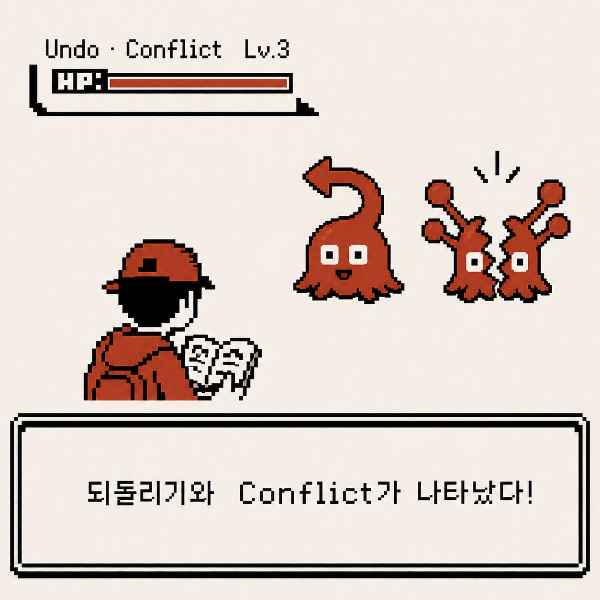
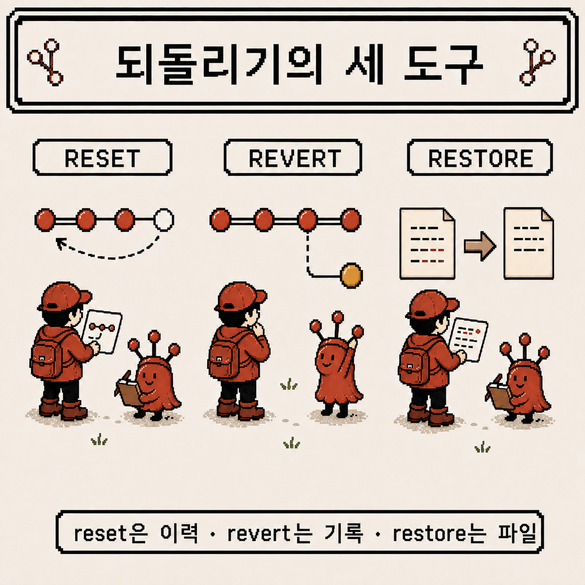
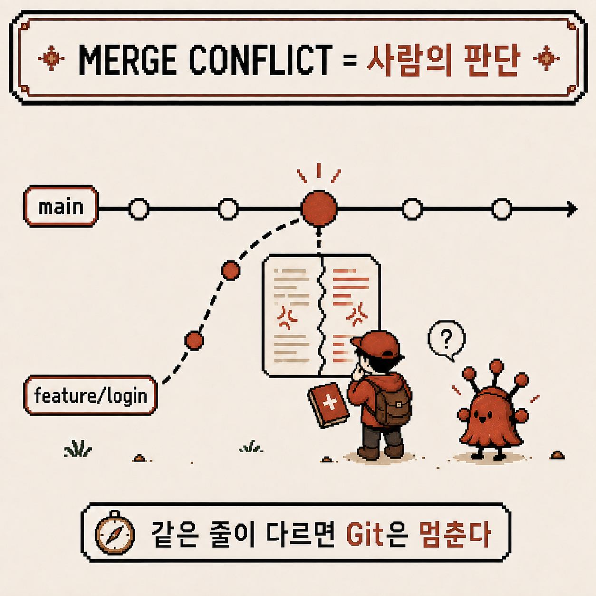
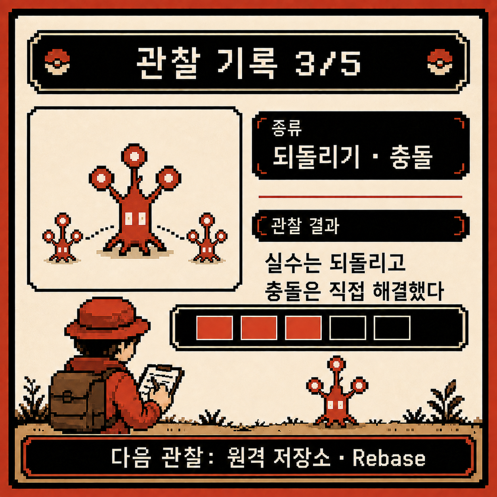

# 코딩 도감 #01 — 되돌리기와 Merge Conflict, 실수와 마주하는 법

지난주 관찰에서 branch로 평행세계를 만들고 merge로 다시 합치는 법까지는 익혔다. 그런데 마지막에 스치듯 남겨둔 두 가지가 계속 마음에 걸렸다. 실수했을 때 되돌리는 법, 그리고 merge 도중 두 세계가 같은 곳을 건드리면 벌어지는 merge conflict.

이번 주는 그 둘을 정면으로 마주해볼 차례다.



---

## 개체 정보

- 이름: Reset, Revert, Restore, Merge Conflict
- 분류: Git의 되돌리기 도구 + 협업 중 필연적으로 마주치는 충돌 상황
- 출현 빈도: 매우 높음 (실수는 항상 일어나고, 협업하면 conflict도 언젠가 온다)
- 위험도: ⚠️⚠️⚠️ (특히 `reset --hard`는 커밋을 진짜로 날려버릴 수 있다)

---

## 처음 만났을 때의 인상

되돌리기 명령을 처음 마주쳤을 땐 이런 느낌이었다.

- `reset`, `revert`, `checkout`, `restore`… 이름은 다 비슷한데 뭐가 다른지 모르겠다
- 일단 아무거나 써봤다가 커밋이 통째로 사라져서 식은땀을 흘렸다
- `git merge`를 실행했더니 `CONFLICT (content): Merge conflict in ...`가 떴다. 화면 가득한 `<<<<<<<`, `=======`, `>>>>>>>`를 보고 패닉에 빠져서 그냥 저장소를 통째로 다시 클론한 적도 있다

`git merge --abort`라는 도피처가 있다는 걸 알았다면 그렇게까지 극단적인 선택은 안 했을 텐데.

---

## 관찰 1 — 되돌리기는 세 가지가 서로 다른 일을 한다

가장 먼저 정리한 건 이거였다. `reset`, `revert`, `restore`는 전부 "되돌린다"고 뭉뚱그려 부르지만, 실제로 건드리는 대상이 다르다.

```
git reset --soft HEAD~1    # 커밋만 취소, 변경 내용은 staging에 그대로
git reset --mixed HEAD~1   # 기본값. staging까지 해제, 파일 내용은 working directory에 남음
git reset --hard HEAD~1    # 커밋과 변경 내용을 전부 삭제 (복구 어려움, 주의)

git revert <commit-hash>   # 과거 커밋은 그대로 두고, 그 변경을 취소하는 "새 커밋"을 추가

git restore <file>         # working directory에서 파일의 변경 내용만 취소 (옛 checkout -- <file>)
git restore --staged <file># staging만 해제, 파일 내용은 그대로
```

기준을 이렇게 잡으니 헷갈리지 않게 됐다.

- 아직 아무도 안 본 내 로컬 커밋을 정리하고 싶다 → `reset`
- 이미 push해서 남들도 보고 있는 커밋을 취소하고 싶다 → `revert` (이력을 지우지 않고 안전하게)
- 커밋까지 갈 것도 없이 방금 수정한 파일만 원래대로 되돌리고 싶다 → `restore`

특히 `reset --hard`는 로컬에 백업되지 않은 변경 내용을 정말로 삭제한다는 걸 실감한 뒤로는, 지우기 전에 항상 `git status`와 `git log --oneline`으로 뭘 지우는지부터 확인하는 습관이 생겼다.



---

## 관찰 2 — Merge Conflict는 Git이 판단을 못 하는 순간이다

지난주 관찰 3에서 짐작만 했던 상황을 이번엔 직접 겪었다. 두 브랜치가 같은 파일의 같은 줄을 서로 다르게 고쳐놓고 merge를 시도하면 이런 일이 벌어진다.

```
git switch main
git merge feature/login
# Auto-merging src/login.js
# CONFLICT (content): Merge conflict in src/login.js
# Automatic merge failed; fix conflicts and then commit the result.
```

Git이 "이 부분은 두 브랜치가 서로 다르게 고쳐서, 어느 쪽이 맞는지 나는 모른다"고 손을 든 상태다. `git status`로 확인해보면 충돌난 파일이 `both modified`로 표시된다.



파일을 열어보면 이렇게 마커로 양쪽 내용이 표시돼 있다.

```
<<<<<<< HEAD
const greeting = "안녕하세요";
=======
const greeting = "Hello";
>>>>>>> feature/login
```

`HEAD`부터 `=======`까지가 지금 서 있는 브랜치(`main`)의 내용이고, `=======`부터 `>>>>>>>`까지가 merge하려던 브랜치(`feature/login`)의 내용이다. 방향 감각이 여기서도 그대로 이어진다는 걸 깨달았다.

---

## 관찰 3 — 충돌 해결은 결국 "선택하고 알리는" 과정이다

conflict 해결 자체는 생각보다 단순했다. 절차로 정리하면 이렇다.

```
# 1. 마커를 보고 어느 내용을 남길지 결정 (둘 다 살릴 수도, 하나만 고를 수도, 새로 쓸 수도 있다)
# 2. <<<<<<<, =======, >>>>>>> 마커를 전부 지우고 최종 내용만 남긴다
# 3. Git에게 "이 파일은 해결했다"고 알린다
git add src/login.js

# 4. 남은 충돌이 없으면 merge를 완료한다
git commit
# 또는
git merge --continue
```

만약 도중에 "역시 이 merge는 아니다" 싶으면 언제든 되돌아갈 수 있다.

```
git merge --abort   # merge 시작 전 상태로 완전히 복귀
```

이걸 알고 나니 처음 conflict를 만났을 때처럼 저장소를 통째로 다시 클론할 필요가 전혀 없었다는 걸 알게 됐다. conflict는 사고가 아니라, Git이 "여기는 사람이 판단해달라"고 요청하는 정상적인 절차였다.

---

## 요약 정리

- `reset`은 로컬 커밋 정리, `revert`는 공개된 커밋을 안전하게 취소, `restore`는 파일 변경만 되돌림
- `reset --hard`는 변경 내용을 진짜로 삭제하므로 실행 전 `git status`/`git log`로 확인하는 습관이 필요
- Merge conflict는 Git이 두 브랜치의 차이를 스스로 판단할 수 없을 때 사람에게 넘기는 상황
- 충돌 마커(`<<<<<<<`/`=======`/`>>>>>>>`)를 정리하고 `git add` → `git commit`(또는 `git merge --continue`)이면 끝
- 마음에 안 들면 `git merge --abort`로 언제든 원상복구 가능

---

## 코딩 도감 메모

되돌리기 명령들을 정리하고 나니 실수에 대한 두려움이 확실히 줄었다 — 뭘 어디까지 지우는지 알고 쓰는 것과 모르고 쓰는 건 완전히 다른 경험이었다. Merge conflict도 마찬가지였다. 정체를 모를 때는 공포였지만, 구조를 알고 나니 그냥 "선택하고 알리는" 절차일 뿐이었다.

지금까지는 전부 내 컴퓨터 안에서만 벌어지는 일이었다. 다음 주부터는 무대가 넓어진다 — 원격 저장소로 다른 사람과 코드를 주고받고, rebase로 커밋 이력을 정리하는 법을 관찰할 차례다.


