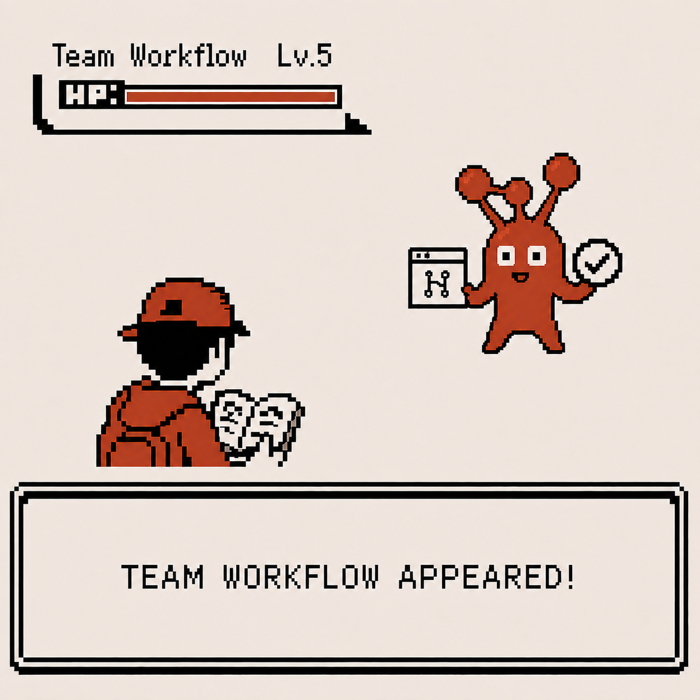
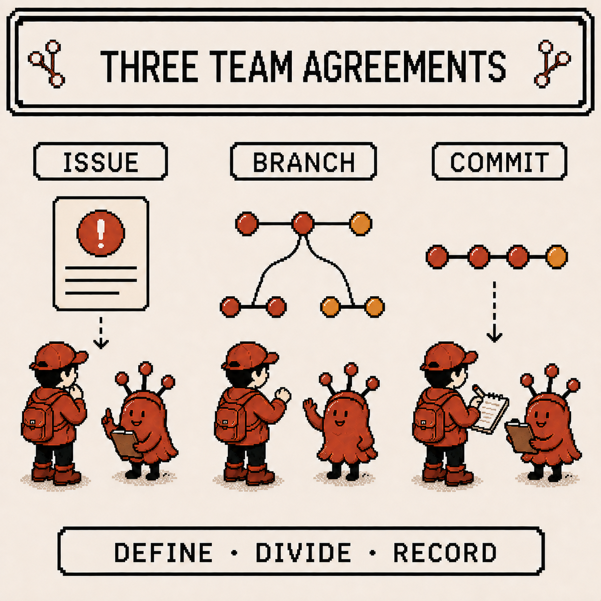
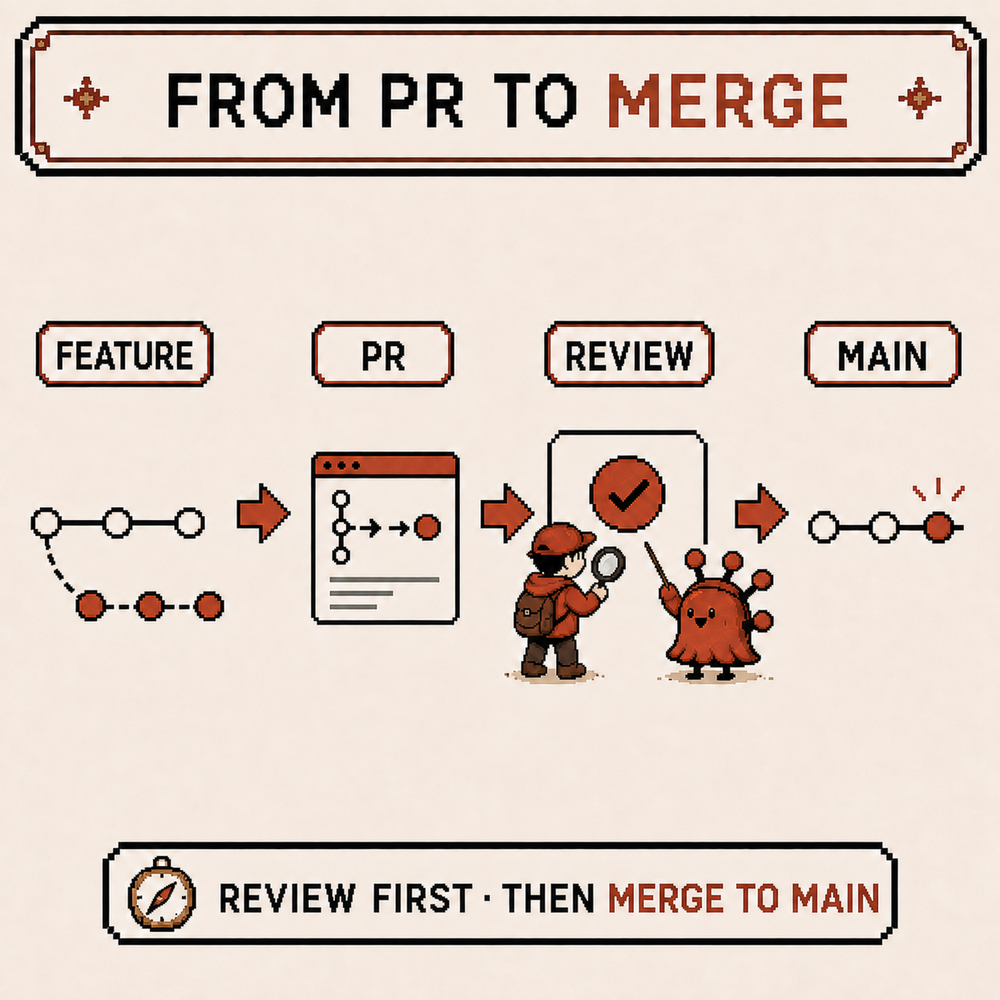
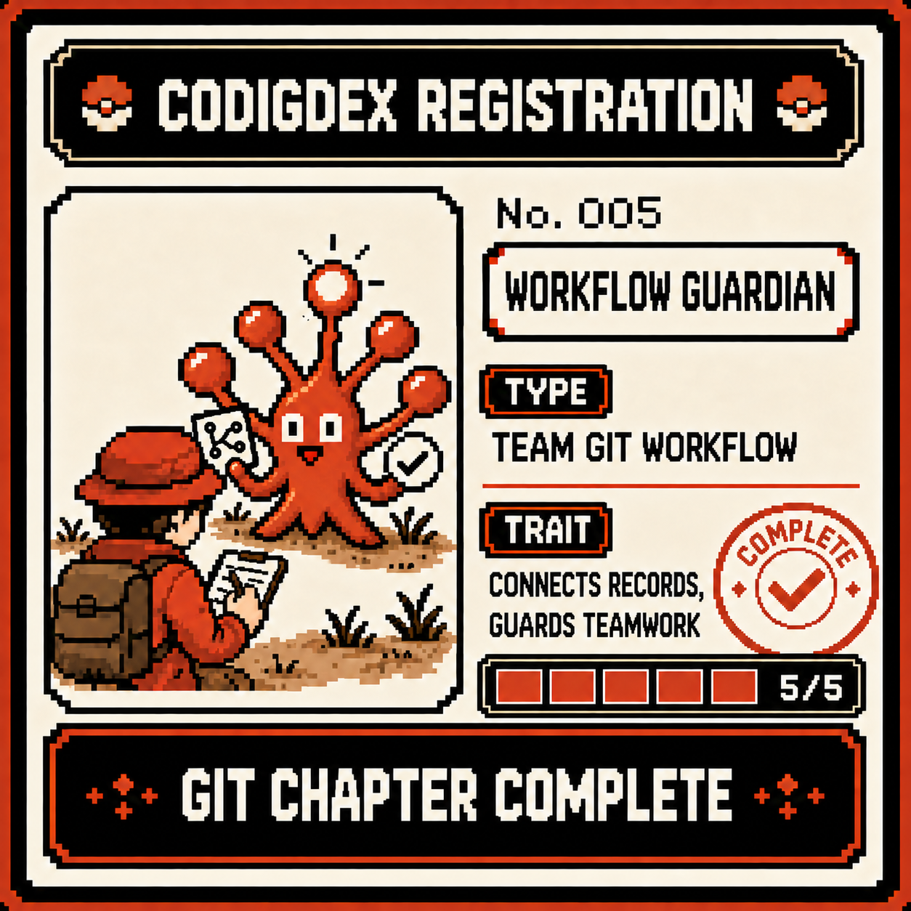

# Codigdex #01 — The Collaboration Workflow, and a Complete Git Chapter

Four observations in, I've run into nearly every major Git tool: commits, branches, merges, undoing changes, merge conflicts, remotes, and rebase. This is the last observation in the Git chapter. Time to see how all these tools come together into one flow on a real team, and register the final specimen to complete the Git chapter.



---

## Specimen info

- Dex number: NO.005 Workflow Guardian
- Name: Collaboration Workflow (Issue → Branch → Commit → PR → Review → Merge)
- Classification: Team-level Git working procedure
- Encounter rate: Very high (shows up without exception on any team project)
- Danger level: ⚠️⚠️ (skip the procedure, and every tool learned so far gets tangled up)

---

## First impression

My first impression of the collaboration workflow was something like this.

- Why so much process, when you could just fix the code and push straight to `main`?
- I thought an Issue was basically a bug-report board
- The first time I opened a PR, I had no idea what the reviewer was even looking at — I just waited for approval

Things that seemed completely unnecessary when working solo turned out, the moment more people got involved, to each have a real reason behind them.

---

## Observation 1 — collaboration's three agreements: Issue, Branch, Commit

The first thing I sorted out was that a team sharing the same repository avoids stepping on each other by keeping three agreements.



- **Issue**: define the work in writing first. "What, and why" lives here
- **Branch**: one branch per issue. Everyone works in their own parallel world, just like week 2
- **Commit**: break the work into small recorded steps. When you need to undo something later (week 3), this is the safety net

The procedure that felt like pure overhead when working alone turned out to be the minimum apparatus for showing "who's doing what, and why" once multiple people touch the same code at once.

---

## Observation 2 — from PR to merge, joining only after review

Once work on a branch is done, it doesn't go straight into `main` — a Pull Request (PR) opens first.



```text
Work & commit on a feature branch
        │
        ▼
Open a PR (propose the changes to a reviewer)
        │
        ▼
Review (someone else checks the code and leaves feedback)
        │
        ▼
Once approved, merge into main
```

A PR turned out to be exactly where rebase and merge from week 4 get used in practice. If I want to clean up my branch before review, that's rebase; once someone's already reviewing the PR, I don't rebase out from under them — I add more commits or merge instead. The "golden rule" from last week applies here directly.

---

## Observation 3 — five observations that were really one flow all along

Getting this far, it became clear that the past five weeks weren't separate lessons — they were all parts built for this one workflow.

- Define the work with an Issue, split it up with branches (weeks 1–2)
- Undo mistakes as they happen, resolve conflicts when you touch the same code as someone else (week 3)
- Push to the remote once it's done, clean up history with rebase if needed (week 4)
- Open a PR, get reviewed, merge into main once approved (this week)

Learning each Git command one at a time made them feel like independent tools. Seen inside the collaboration workflow, they were all in service of one purpose the whole time: letting multiple people safely build one shared history together.

---

## Summary

- Collaboration starts with three agreements: Issue (define the work), Branch (split it up), Commit (record it)
- Finished work doesn't merge immediately — it goes through a PR and Review first
- Rebase before the PR is open, merge after — last week's golden rule in practice
- Every observation so far (commit, branch, merge, undo, conflict, remote, rebase) converges into this one workflow

---

## Codigdex notes

Five weeks ago, Git was just a set of commands to memorize. Now it looks like one complete flow: leaving a record (commit), spinning up parallel worlds (branch), merging them back (merge), undoing mistakes (reset/revert/restore), resolving collisions (conflict), talking to a remote (fetch/pull/push), restacking history (rebase), and finally, getting reviewed together with a team (PR/review).

The next chapter is Codigdex #02: Linux. All those Git commands had to run somewhere — so next, it's time to observe what's on the other side of the terminal, starting with the shell.

Before that, the last specimen of the Git chapter goes into the Codigdex. **NO.005 Workflow Guardian** — connects records, guards teamwork. With it, all five slots of the Git chapter, starting from NO.001 Git Sprout, are filled.


