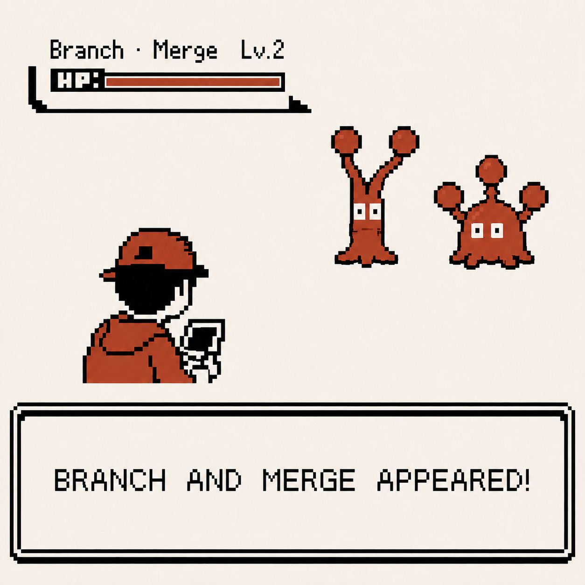
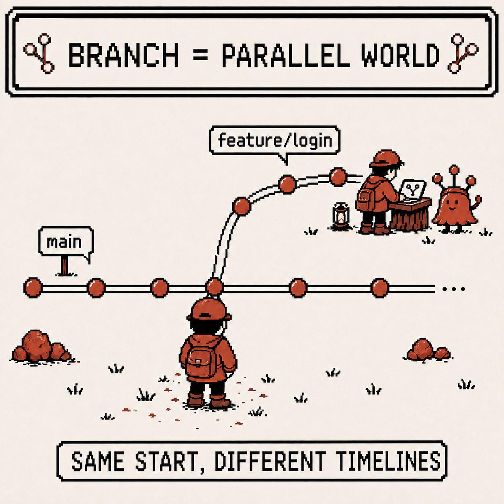
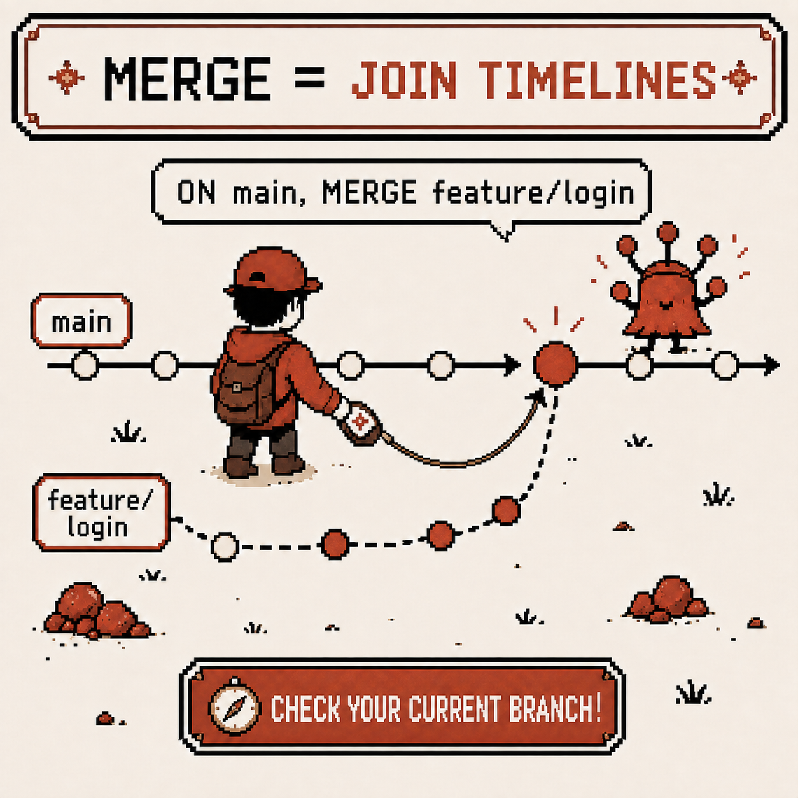
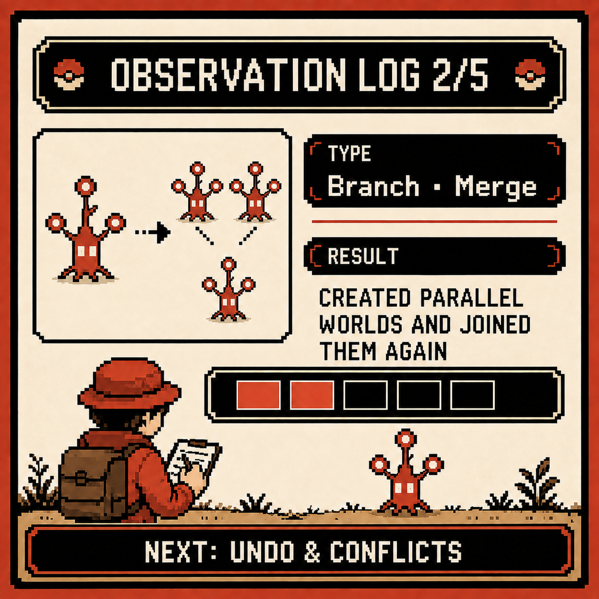

# Codigdex #01 — Branch and Merge, Handling Parallel Worlds

Last week I had my first encounter with Git and got as far as understanding that a commit is a "record." But there was something else I ended up using constantly in practice: **branch** and **merge**.

This week's observation log starts here.



---

## Specimen info

- Name: Branch, Merge
- Classification: Git's parallel-work management feature
- Encounter rate: Very high (essential on collaborative projects)
- Danger level: ⚠️⚠️ (use it without understanding it, and you'll fall into the merge conflict trap)

---

## First impression

My first impression of branches was something like this.

- Isn't `main` enough? Why do I need to make another branch?
- I definitely worked on my branch, so why can't I see anyone else's code?
- I merged and got some incomprehensible conflict message…

For now I just did what I was told:

```
git checkout -b feature/my-work
```

I was memorizing just this and creating new branches, without knowing what was actually happening inside.

---

## Observation 1 — Branch is a "parallel world"

The first thing I understood was this.

A branch isn't a copy of files — it's **a separate commit timeline inside the same repository**.

- The `main` branch is one timeline
- Creating a new branch spins off another timeline that branches from that point
- The two timelines don't affect each other — whatever I do on the `feature` branch, `main` stays exactly as it was

```
git branch feature/login       # just create the branch
git switch feature/login       # move to the branch
# or in one step
git switch -c feature/login
```

Once I understood that, the answer to "why split into branches" came naturally: to build a parallel world where I can fail freely and experiment, and bring only what's verified back into the original world (`main`).



---

## Observation 2 — Merge brings two timelines back together

Once work on a branch is done, that timeline needs to be merged back into the original branch. That's merge.

```
git switch main
git merge feature/login
```

The important part here: **merge always pulls the other branch in relative to "whichever branch I'm currently standing on."** Running `git merge feature/login` while on `main` means "bring feature/login's changes into main" — not the other way around.

I once nearly merged into the wrong branch because I mixed up the direction. Now, before every merge, I always check `git branch` or `git status` first to see which timeline I'm standing on.



---

## Observation 3 — Fast-forward and 3-way merge aren't the same

After doing a few merges, I noticed the result isn't always identical.

- **Fast-forward merge**: if `main` hasn't changed at all since the branch split off, Git just moves the pointer forward. No new commit is created.
- **3-way merge**: if `main` also picked up other commits in the meantime, Git compares the changes against the two branches' common ancestor and creates a new **merge commit**.

```
git log --oneline --graph --all
```

Only after seeing branches split and rejoin with this command did the difference between the two really click. I could also guess that a **merge conflict** — which happens when two branches touch the same spot in the code — is a situation where Git, in the middle of a 3-way merge, "can't decide which side to pick." Actually resolving a conflict, though, is next week's observation.

---

## Summary

- A branch isn't a file copy, it's a separate commit timeline
- Merge pulls the other branch in relative to "whichever branch I'm currently on"
- Fast-forward just moves the pointer, 3-way merge creates a new merge commit
- Making a habit of checking branch structure visually with `git log --graph` helps a lot with understanding

---

## Codigdex notes

Before I knew about branches, I thought Git was "one straight line." Now I see Git is closer to a tool that lets you freely spin up parallel worlds and merge the verified ones back in.

I still haven't really experienced what happens when two worlds touch the same spot during a merge. Next observation, it's time to face reset/revert/checkout and merge conflicts head-on.


