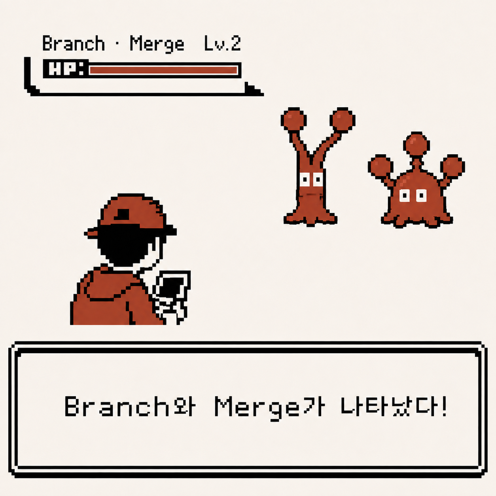
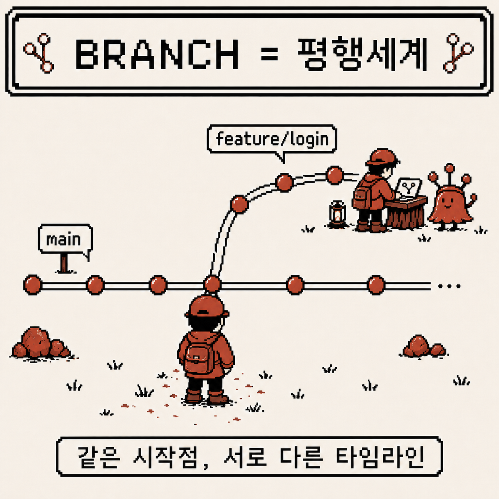
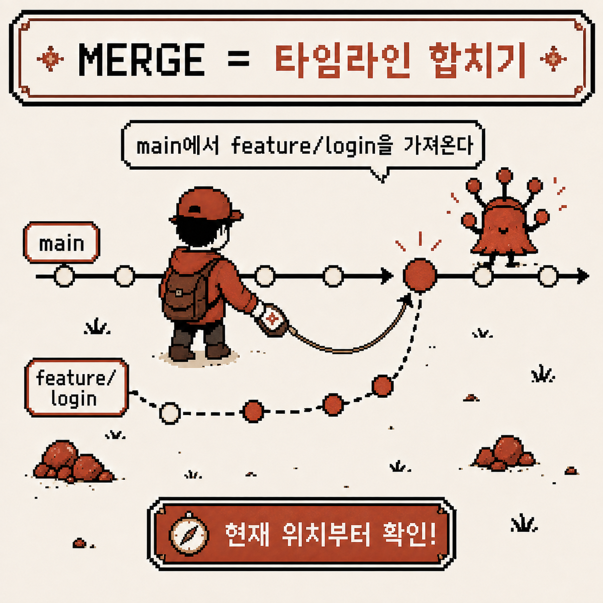
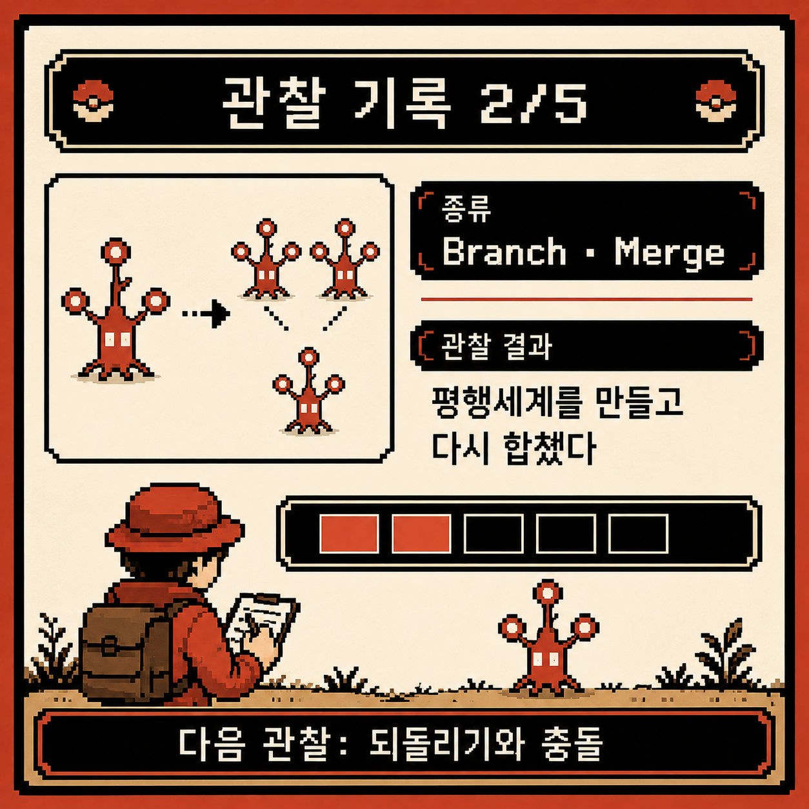

# 코딩 도감 #01 — Branch와 Merge, 평행세계를 다루는 법

지난주 Git과 첫 조우를 마치고, commit이 "기록"이라는 것까지는 이해했다. 그런데 실전에서 진짜 자주 쓰는 건 따로 있었다. 바로 **branch**와 **merge**.

이번 주 관찰 기록은 여기서 시작한다.



---

## 개체 정보

- 이름: Branch, Merge
- 분류: Git의 평행 작업 관리 기능
- 출현 빈도: 매우 높음 (협업 프로젝트에서는 필수)
- 위험도: ⚠️⚠️ (개념 없이 쓰면 merge conflict라는 함정에 빠짐)

---

## 처음 만났을 때의 인상

브랜치를 처음 접했을 땐 이런 느낌이었다.

- `main`이면 됐지 브랜치는 왜 또 만들어야 하지?
- 분명 내 브랜치에서 작업했는데 왜 다른 사람 코드가 안 보이지?
- merge 했더니 알 수 없는 충돌 메시지가 떴다…

일단은 시키는 대로

```
git checkout -b feature/my-work
```

이것만 외워서 새 브랜치를 만들고 있었고, 그 안에서 무슨 일이 벌어지는지는 몰랐다.

---

## 관찰 1 — Branch는 "평행세계"다

가장 먼저 이해한 건 이거였다.

브랜치는 파일을 복사하는 게 아니라, **같은 저장소 안에서 별도의 커밋 흐름을 만드는 것**이다.

- `main` 브랜치는 하나의 타임라인
- 새 브랜치를 만들면 그 시점부터 갈라지는 또 다른 타임라인이 생긴다
- 두 타임라인은 서로 영향을 주지 않는다 — 내가 `feature` 브랜치에서 무슨 짓을 해도 `main`은 그대로다

```
git branch feature/login       # 브랜치 생성만
git switch feature/login       # 브랜치로 이동
# 또는 한 번에
git switch -c feature/login
```

이걸 알고 나니, "왜 브랜치를 나누는가"에 대한 답도 자연스럽게 나왔다. 실패해도 되는 평행세계를 만들어서 마음껏 실험하고, 검증된 것만 원래 세계(`main`)로 가져오기 위해서였다.



---

## 관찰 2 — Merge는 두 타임라인을 다시 합치는 것

브랜치에서 작업을 끝내면, 이제 그 타임라인을 원래 브랜치에 합쳐야 한다. 그게 merge다.

```
git switch main
git merge feature/login
```

여기서 중요한 건 **merge는 항상 "지금 내가 서 있는 브랜치" 기준으로 상대 브랜치를 끌어온다**는 점이다. `main`에서 `git merge feature/login`을 실행하면 "feature/login의 변경사항을 main으로 가져온다"는 뜻이지, 반대가 아니다.

방향을 헷갈려서 엉뚱한 브랜치에 merge할 뻔한 적도 있었다. 지금은 merge 전에 항상 `git branch` 또는 `git status`로 내가 어느 타임라인에 서 있는지부터 확인한다.



---

## 관찰 3 — Fast-forward와 3-way merge는 다르다

merge를 몇 번 해보니, 결과가 매번 똑같지 않다는 걸 알게 됐다.

- **Fast-forward merge**: `main`이 갈라진 이후로 전혀 변경되지 않았다면, Git은 그냥 포인터만 앞으로 옮긴다. 새로운 커밋이 생기지 않는다.
- **3-way merge**: `main`도 그 사이에 다른 커밋이 쌓였다면, Git은 두 브랜치의 공통 조상을 기준으로 변경사항을 비교해서 **merge commit**을 새로 만든다.

```
git log --oneline --graph --all
```

이 명령으로 브랜치들이 갈라지고 다시 합쳐지는 모양을 눈으로 보고 나서야 두 방식의 차이가 확 와닿았다. 같은 코드 위치를 두 브랜치가 동시에 건드렸을 때 발생하는 **merge conflict**는, 3-way merge 과정에서 Git이 "어느 쪽을 선택해야 할지 판단 못 하는" 상황이라는 것도 짐작할 수 있었다 — 다만 실제로 conflict를 해결하는 법은 다음 주 관찰 대상이다.

---

## 요약 정리

- Branch는 파일 복사가 아니라 별도의 커밋 타임라인
- Merge는 "지금 서 있는 브랜치" 기준으로 상대 브랜치를 끌어오는 것
- Fast-forward는 포인터만 이동, 3-way merge는 새 merge commit 생성
- `git log --graph`로 브랜치 구조를 눈으로 확인하는 습관이 이해에 큰 도움이 됨

---

## 코딩 도감 메모

브랜치를 알기 전엔 Git이 "하나의 직선"이라고 생각했다. 이제 보니 Git은 여러 평행세계를 자유롭게 만들고, 검증되면 다시 합치는 도구에 더 가까웠다.

다만 merge 도중 두 세계가 같은 곳을 건드리면 무슨 일이 벌어지는지는 아직 제대로 겪어보지 못했다. 다음 관찰에서는 되돌리기(`reset`/`revert`/`checkout`)와 merge conflict를 직접 마주해볼 차례다.


