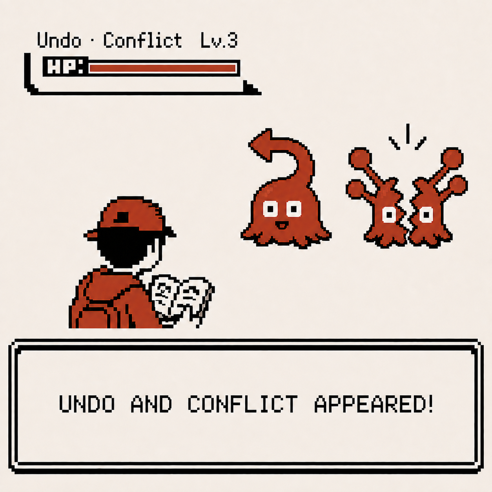
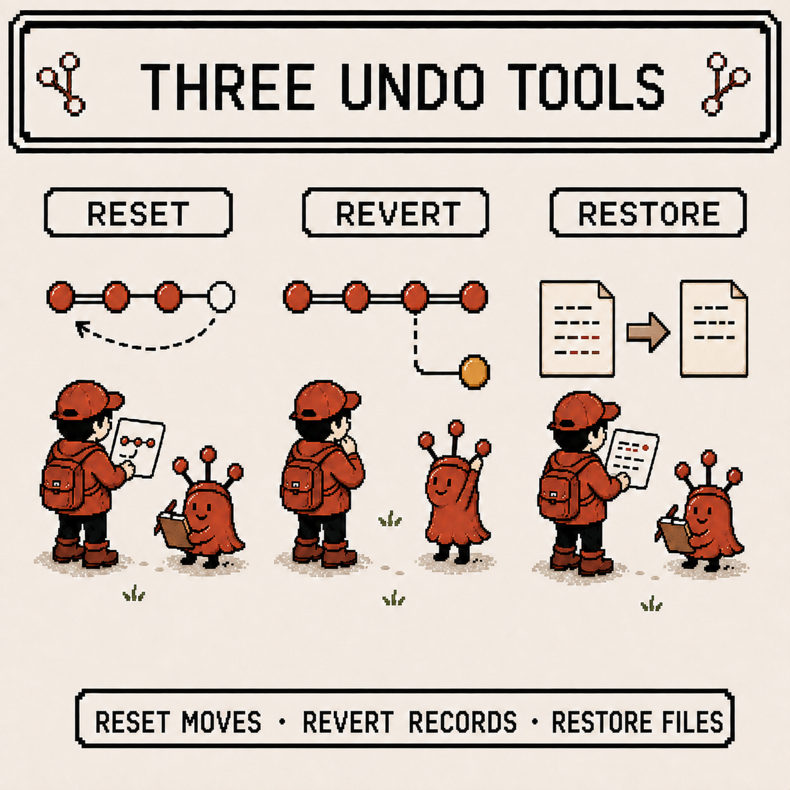
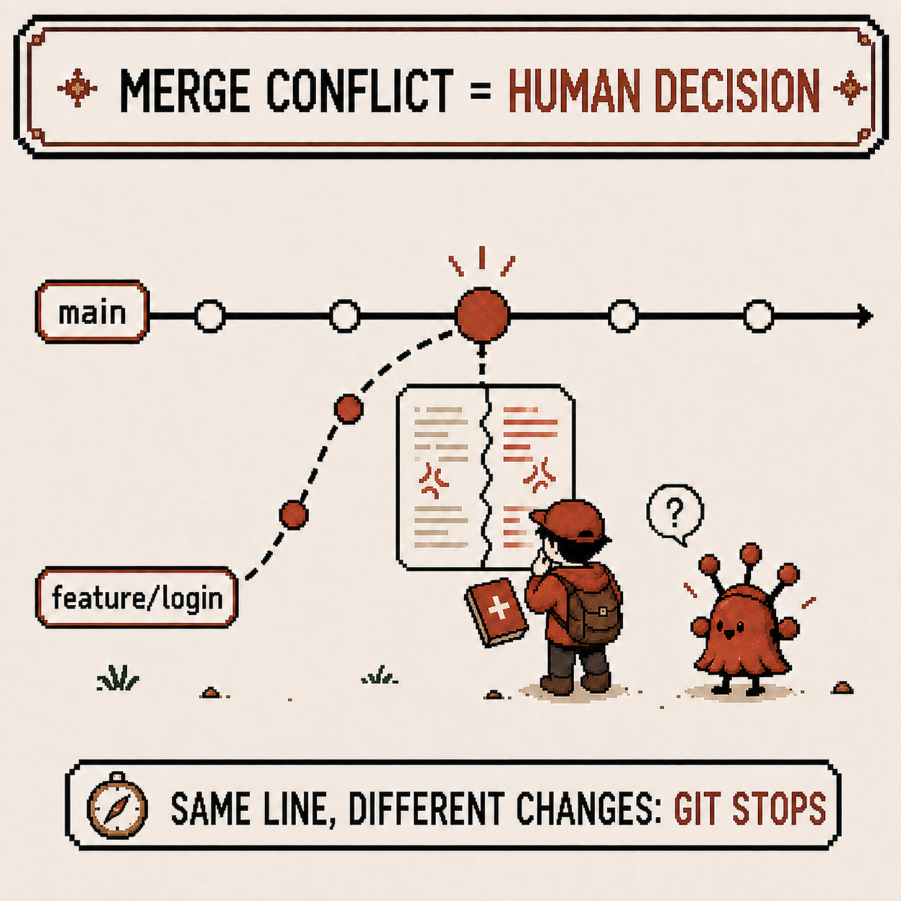
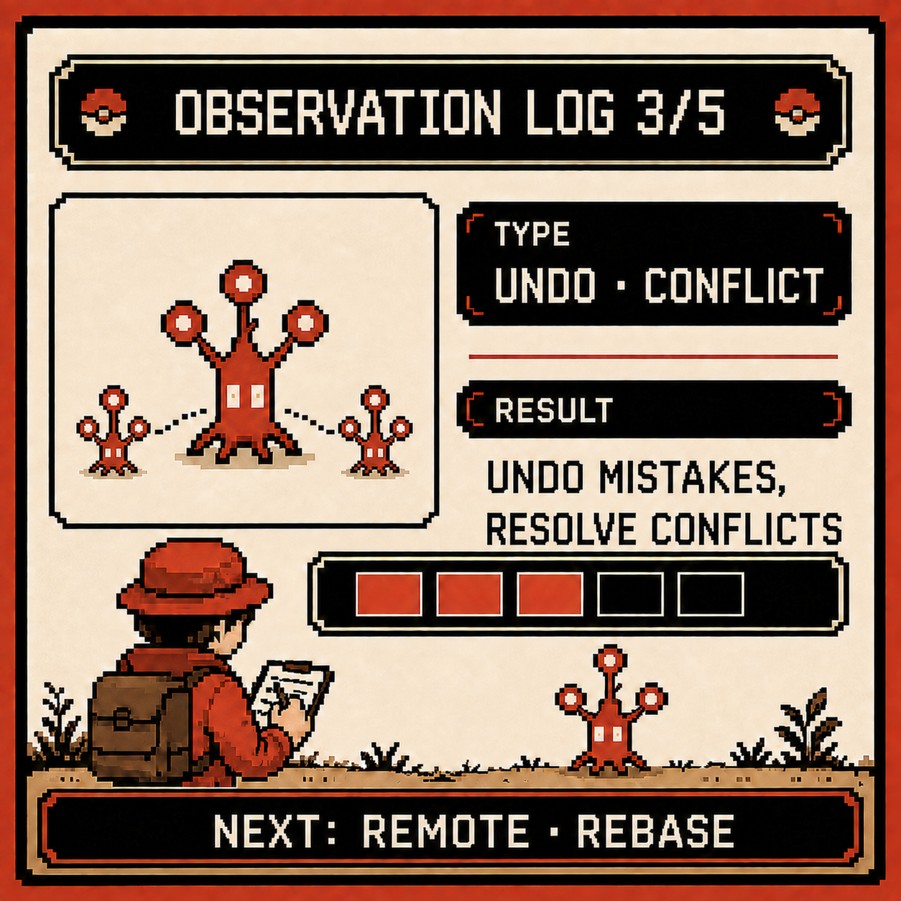

# Codigdex #01 — Undoing Things and Merge Conflicts, Facing Your Mistakes

Last week's observation covered how branches spin off parallel worlds and how merge brings them back together. But two things I only brushed past at the end kept bothering me: how to undo a mistake, and what happens when two worlds touch the same spot during a merge — the merge conflict.

This week, it's time to face both head-on.



---

## Specimen info

- Name: Reset, Revert, Restore, Merge Conflict
- Classification: Git's undo tools, plus the collision every collaborator eventually runs into
- Encounter rate: Very high (mistakes always happen, and conflicts arrive sooner or later once you collaborate)
- Danger level: ⚠️⚠️⚠️ (`reset --hard` in particular can genuinely wipe out commits)

---

## First impression

My first impression of the undo commands was something like this.

- `reset`, `revert`, `checkout`, `restore` — the names all sound similar, and I couldn't tell what set them apart
- I tried one at random once and watched an entire commit vanish, breaking into a cold sweat
- I ran `git merge` and got `CONFLICT (content): Merge conflict in ...`. Staring at a screen full of `<<<<<<<`, `=======`, and `>>>>>>>`, I panicked and just re-cloned the whole repository from scratch

If I'd known `git merge --abort` existed as an escape hatch, I wouldn't have had to go that far.

---

## Observation 1 — the three undo tools each do a different job

The first thing I sorted out was this: `reset`, `revert`, and `restore` all get lumped together as "undoing," but they actually operate on different things.

```
git reset --soft HEAD~1    # undoes only the commit; changes stay staged
git reset --mixed HEAD~1   # default. unstages too, but file contents stay in the working directory
git reset --hard HEAD~1    # deletes the commit AND the changes entirely (hard to recover — be careful)

git revert <commit-hash>   # leaves the old commit alone, adds a NEW commit that undoes its changes

git restore <file>         # undoes changes to a file in the working directory (the old checkout -- <file>)
git restore --staged <file># unstages only; file contents are untouched
```

Framing it this way made the choice obvious:

- Want to clean up local commits nobody else has seen yet? → `reset`
- Want to undo a commit that's already pushed and visible to others? → `revert` (safe, keeps history intact)
- Don't even need to touch a commit, just want to undo a file you just edited? → `restore`

Once it really sank in that `reset --hard` truly deletes unbacked-up changes, I picked up the habit of checking `git status` and `git log --oneline` before deleting anything, to see exactly what I'm about to lose.



---

## Observation 2 — a merge conflict is the moment Git can't decide

The situation I could only guess at in last week's observation 3, I finally ran into directly. When two branches each change the same line of the same file in different ways and you try to merge, this happens:

```
git switch main
git merge feature/login
# Auto-merging src/login.js
# CONFLICT (content): Merge conflict in src/login.js
# Automatic merge failed; fix conflicts and then commit the result.
```

Git is essentially raising its hand and saying "this part was changed differently by both branches, and I don't know which one is right." Checking with `git status` shows the conflicted file marked as `both modified`.



Opening the file shows both sides marked out like this:

```
<<<<<<< HEAD
const greeting = "안녕하세요";
=======
const greeting = "Hello";
>>>>>>> feature/login
```

Everything from `HEAD` down to `=======` is the content of the branch I'm currently standing on (`main`), and everything from `=======` down to `>>>>>>>` is the content of the branch I was merging in (`feature/login`). The same sense of direction from last week's merge observation carries straight over here.

---

## Observation 3 — resolving a conflict is really just "choose, then tell Git"

Actually resolving a conflict turned out to be simpler than it looked. The procedure comes down to this.

```
# 1. Read the markers and decide what to keep (keep both, keep one, or write something new)
# 2. Remove the <<<<<<<, =======, >>>>>>> markers entirely, leaving only the final content
# 3. Tell Git this file is resolved
git add src/login.js

# 4. Once no conflicts remain, finish the merge
git commit
# or
git merge --continue
```

And if partway through I decide this merge isn't worth it after all, I can always back out.

```
git merge --abort   # fully returns to the state right before the merge started
```

Once I knew this, it became clear I never needed to re-clone the whole repository the way I did the first time I hit a conflict. A conflict isn't an accident — it's Git's normal way of saying "a human needs to make the call here."

---

## Summary

- `reset` cleans up local commits, `revert` safely undoes a public commit, `restore` undoes just a file's changes
- `reset --hard` genuinely deletes changes, so get in the habit of checking `git status`/`git log` before running it
- A merge conflict is when Git hands a decision back to a human because it can't judge the difference between two branches on its own
- Clean up the conflict markers (`<<<<<<<`/`=======`/`>>>>>>>`), then `git add` → `git commit` (or `git merge --continue`), and you're done
- Not happy with how it's going? `git merge --abort` returns you to square one at any point

---

## Codigdex notes

Sorting out the undo commands noticeably shrank my fear of making mistakes — knowing exactly what you're about to delete is a completely different experience from not knowing. Merge conflicts were the same story. They were terrifying as an unknown, but once I understood the mechanics, they turned out to be nothing more than a "choose, then tell Git" procedure.

Everything so far has happened entirely on my own machine. Starting next week, the stage gets bigger — it's time to observe exchanging code with other people through a remote repository, and cleaning up commit history with rebase.


