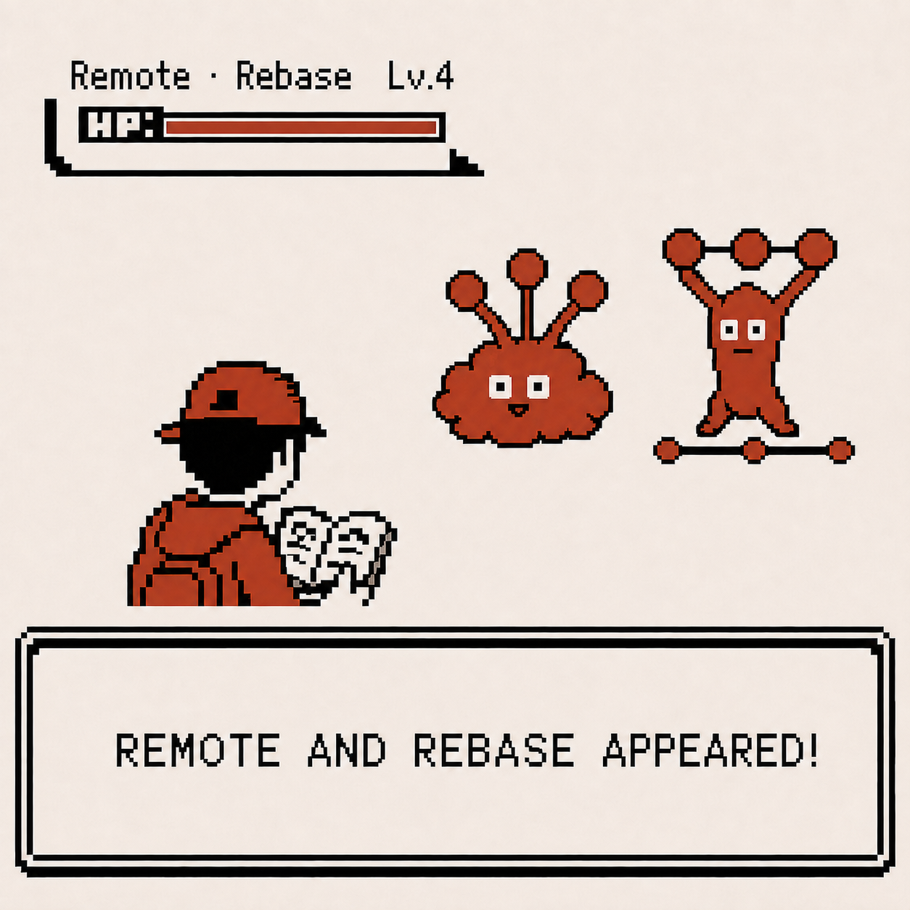
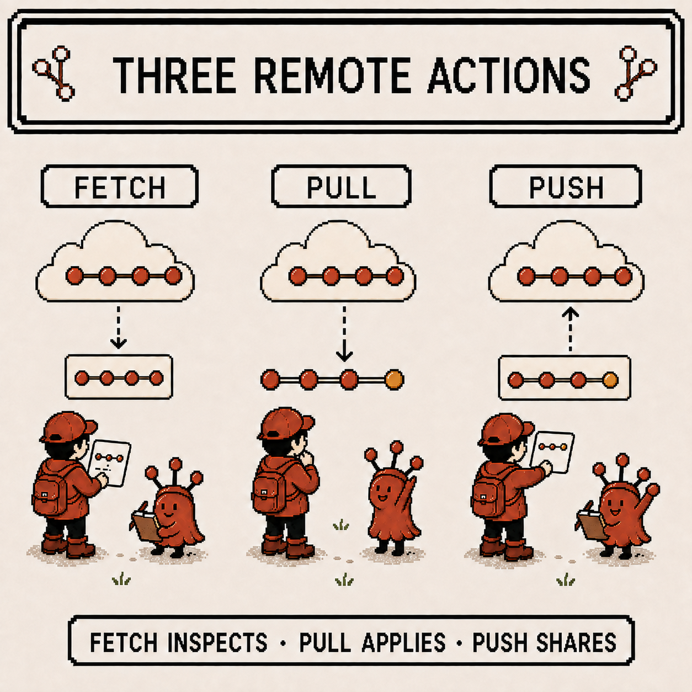
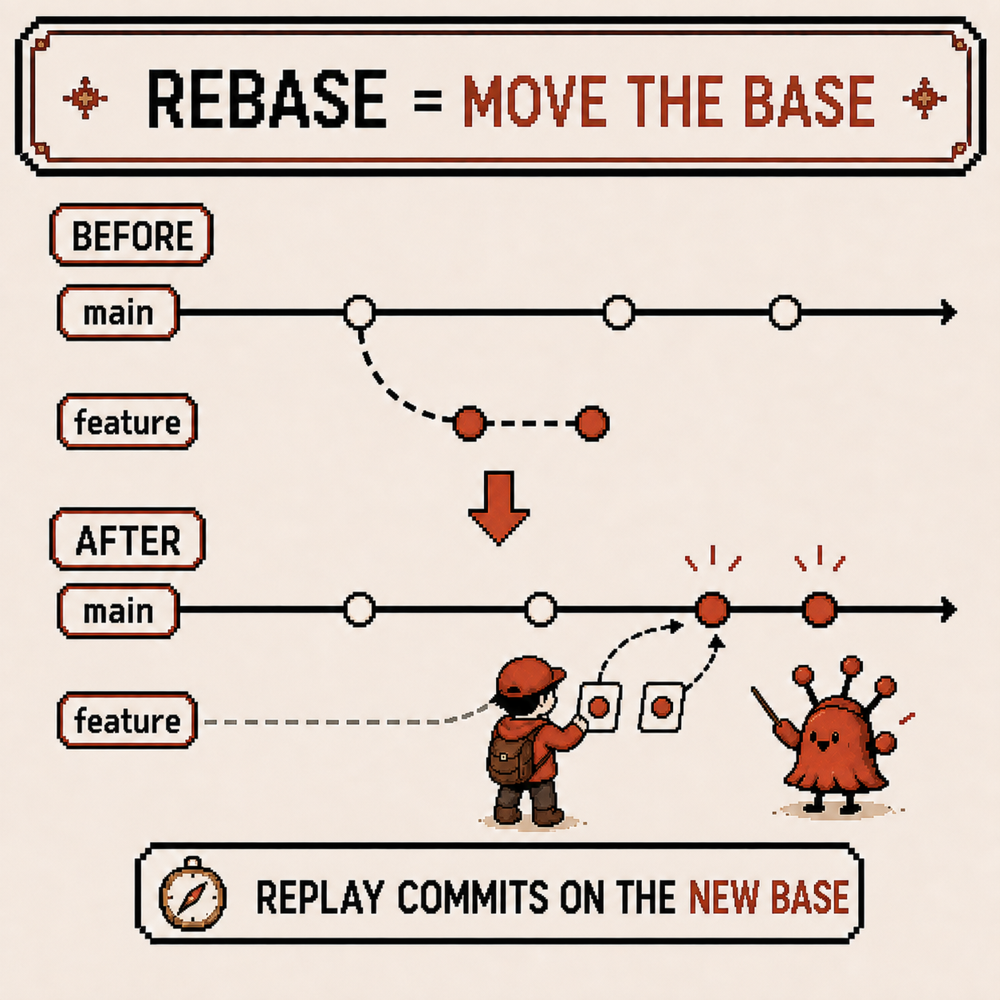
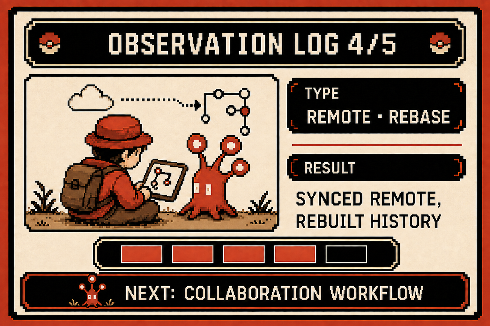

# Codigdex #01 — Remotes and Rebase, Rebuilding History

After facing undoing changes and merge conflicts last week, it hit me that everything so far had happened entirely on my own machine. Time to widen the stage: remote repositories for exchanging code with other people, and rebase for reshaping commit history.



---

## Specimen info

- Name: Remote, Rebase
- Classification: Remote collaboration feature + commit-history restructuring feature
- Encounter rate: Very high (used daily on collaborative projects)
- Danger level: ⚠️⚠️⚠️⚠️ (rebasing already-shared history can cause real trouble for the whole team)

---

## First impression

My first impression of remotes and rebase was something like this.

- What is `origin/main`, and how is it different from plain `main`? Why are there two?
- `fetch` and `pull` look similar — I couldn't tell them apart
- I ran rebase and then my push got rejected. It told me to use `--force`, and that scared me — was it actually okay to use?

Whenever something went wrong, I just kept hitting `git pull` and hoping for the best.

---

## Observation 1 — there are three ways to talk to a remote

The first thing I sorted out was that local and remote aren't always connected in real time. If I want to know the remote's latest state, I have to ask first.

```
git fetch    # check the remote's latest state only (doesn't touch my work yet)
git pull     # fetch + merge into my branch, in one step
git push     # upload my commits to the remote
```

That's also what untangled the `origin/main` confusion. `origin/main` is a local snapshot pointing to "the remote's `main` as of my last fetch," while `main` is the local branch I actually work on. `git fetch` is what refreshes `origin/main`, and bringing that into my own `main` still needs one more `merge` (or `pull`).



- `fetch` just checks — a safe action with zero effect on my current work
- `pull` checks and applies — fetch immediately followed by a merge (or rebase)
- `push` shares — uploads my local commits to the remote so others can see them

---

## Observation 2 — rebase restacks commits on a new base

I learned there's another way to combine timelines besides merge: rebase.

```
git switch feature/login
git rebase main
```

Where merge leaves both timelines in place and creates a merge commit, rebase does something different. It moves the point where `feature` branched off to `main`'s latest commit, then replays `feature`'s commits one by one on top of that.



The result is a commit graph with no forks — a single straight line. Once I saw that with `git log --oneline --graph`, I understood why people reach for rebase when they want a clean history without merge commits. But I also learned that even though the commits look the same, rebase actually recreates them — every commit hash changes.

---

## Observation 3 — rebase's golden rule: don't touch history that's already shared

Why a changed commit hash is dangerous only really sank in after making the mistake myself.

If you rebase a branch that's already been pushed and pulled by someone else, your local history and the remote history split into completely different commits. Pushing after that gets rejected by Git, and forcing it through with `--force` breaks alignment with everyone else's local history.

```
git push --force-with-lease   # if you must force-push anyway, use this instead of plain --force
```

So the rule I settled on is simple. **A local branch only I've seen is fair game for rebasing to clean up. A branch that's already been pushed and shared gets merged, not rebased.** Remembering it as "rebase before push, merge after push" made it click and stop being confusing.

---

## Summary

- `fetch` checks, `pull` checks and applies, `push` shares — the three ways of talking to a remote
- `origin/main` is a snapshot as of the last fetch; `main` is my actual local working branch
- Rebase moves a branch's base point and rebuilds history as a single straight line
- Rebase changes commit hashes, so don't use it on a branch that's already been shared (pushed)
- If you really must force-push, prefer `--force-with-lease` over plain `--force`

---

## Codigdex notes

This time I really understood that a remote repository isn't just "a warehouse for storing code." Fetch, pull, and push are a way of talking that assumes I and the remote can be at different points in history, and rebase is a tool for restacking that history into whatever shape I want.

Five observations in, I feel like I've mostly figured out Git as a specimen. For the last observation, it's time to put all of this inside a real team-collaboration workflow — and officially register Git into the Codigdex.


