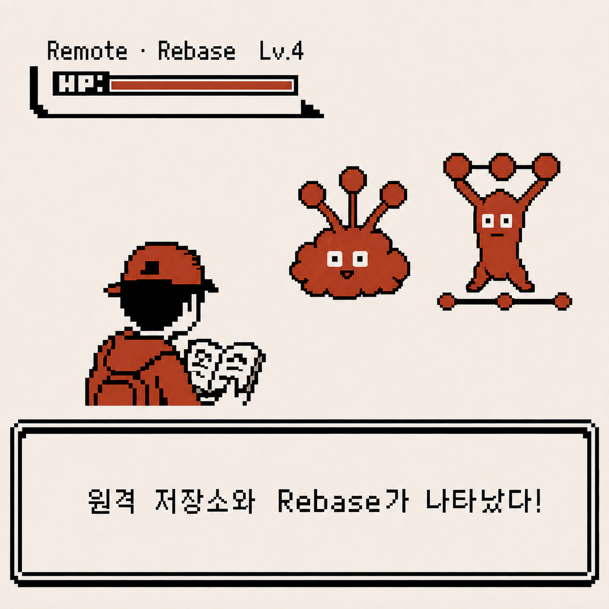
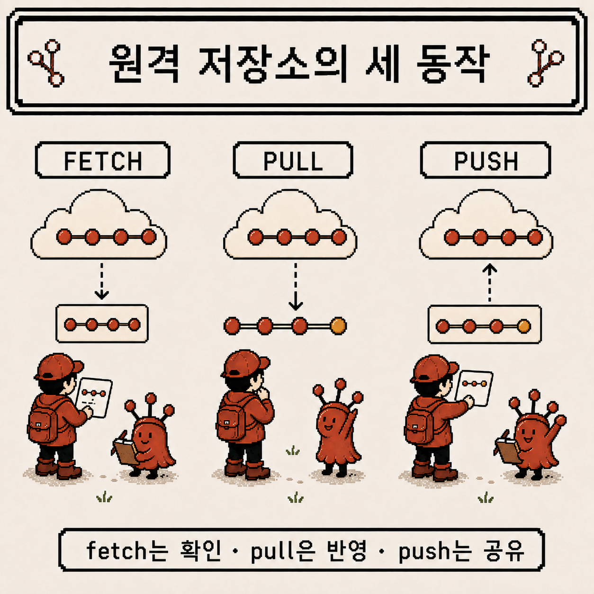
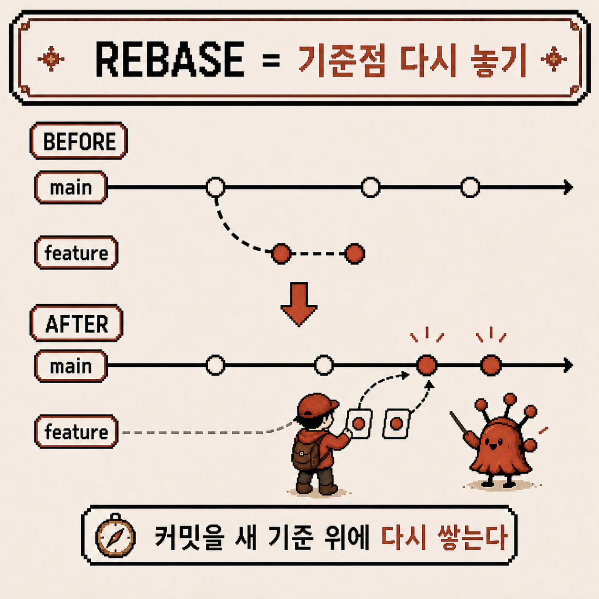
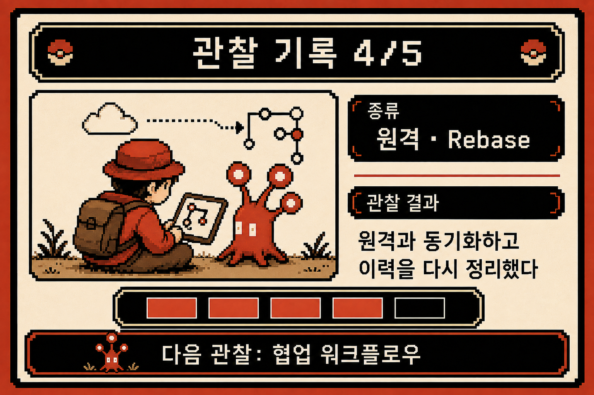

# 코딩 도감 #01 — 원격 저장소와 Rebase, 이력을 다시 쌓는 법

지난주 되돌리기와 merge conflict까지 마주하고 나니, 지금까지 벌어진 일이 전부 내 컴퓨터 안에서만 일어났다는 걸 깨달았다. 이제 무대를 넓힐 차례다. 다른 사람과 코드를 주고받는 원격 저장소, 그리고 커밋 이력을 다시 정리하는 rebase.



---

## 개체 정보

- 이름: Remote, Rebase
- 분류: 원격 협업 기능 + 커밋 이력 재구성 기능
- 출현 빈도: 매우 높음 (협업 프로젝트에서는 매일 사용)
- 위험도: ⚠️⚠️⚠️⚠️ (이미 공유된 이력을 rebase하면 팀 전체가 곤란해질 수 있음)

---

## 처음 만났을 때의 인상

원격 저장소와 rebase를 처음 접했을 땐 이런 느낌이었다.

- `origin/main`은 뭐고 그냥 `main`은 또 뭔가 — 왜 두 개가 있지?
- `fetch`랑 `pull`이 비슷해 보이는데 뭐가 다른 건지 모르겠다
- rebase 했더니 push가 거부당했다. `--force`를 쓰라는데, 써도 되는 건지 겁이 났다

일단 문제가 생기면 `git pull`부터 눌러보고 보는 식으로 버텨왔다.

---

## 관찰 1 — 원격 저장소와는 세 가지 방식으로 대화한다

가장 먼저 정리한 건 로컬과 원격이 항상 실시간으로 연결돼 있는 게 아니라는 점이었다. 원격의 최신 상태를 알고 싶으면 내가 먼저 물어봐야 한다.

```
git fetch    # 원격의 최신 상태만 확인 (내 작업물엔 아직 반영 안 함)
git pull     # fetch + 내 브랜치에 병합까지 한 번에
git push     # 내 커밋을 원격에 업로드
```

`origin/main`이 헷갈렸던 이유도 여기서 풀렸다. `origin/main`은 "마지막으로 fetch했을 때의 원격 main 상태"를 가리키는 로컬의 스냅샷이고, `main`은 내가 실제로 작업하는 로컬 브랜치다. `git fetch`를 해야 `origin/main`이 최신으로 갱신되고, 그걸 내 `main`에 반영하려면 `merge`나 `pull`이 한 번 더 필요하다.



- `fetch`는 확인만 하는 안전한 동작 — 내 작업 중인 내용에 아무 영향도 없다
- `pull`은 확인 + 반영 — fetch 뒤에 바로 merge(또는 rebase)까지 실행한다
- `push`는 공유 — 내 로컬 커밋을 원격에 업로드해서 남들도 볼 수 있게 한다

---

## 관찰 2 — Rebase는 커밋을 새 기준 위에 다시 쌓는 것

merge 말고 이력을 합치는 또 다른 방법이 rebase라는 걸 알게 됐다.

```
git switch feature/login
git rebase main
```

merge가 두 타임라인을 그대로 두고 합치는 merge commit을 만드는 거라면, rebase는 다르다. `feature` 브랜치가 갈라진 지점을 아예 `main`의 최신 커밋으로 옮기고, 그 위에 `feature`의 커밋들을 하나씩 다시 쌓는다.



결과적으로 커밋 그래프가 갈래 없이 하나의 직선으로 정리된다. `git log --oneline --graph`로 봤을 때 merge commit 없이 깔끔한 이력을 원할 때 rebase를 쓰는 이유를 이제 알겠다. 다만 커밋 내용은 똑같아 보여도, rebase는 커밋을 새로 만드는 것이라 커밋 해시가 전부 바뀐다는 것도 함께 알게 됐다.

---

## 관찰 3 — Rebase의 황금률: 이미 공유된 이력은 건드리지 않는다

커밋 해시가 바뀐다는 사실이 왜 위험한지는, 실수를 겪고 나서야 몸으로 이해했다.

이미 `push`해서 다른 사람이 pull받아 간 브랜치를 rebase하면, 내 로컬 이력과 원격 이력이 완전히 다른 커밋들로 갈라진다. 그 상태로 push하려면 Git이 거부하고, `--force`로 밀어붙이면 다른 사람의 로컬 이력과 어긋나버린다.

```
git push --force-with-lease   # 그래도 강제로 올려야 한다면, 최소한 이 옵션으로
```

그래서 정리한 규칙은 하나다. **아직 나만 보고 있는 로컬 브랜치는 rebase로 깔끔하게 정리해도 되지만, 이미 push해서 남들과 공유된 브랜치는 rebase하지 않고 merge로 합친다.** 정리 순서를 바꿔서 "push 전에 rebase, push 후에는 merge"로 기억하니 헷갈리지 않게 됐다.

---

## 요약 정리

- `fetch`는 확인, `pull`은 확인+반영, `push`는 공유 — 원격과의 세 가지 대화
- `origin/main`은 마지막 fetch 시점의 스냅샷, `main`은 내 로컬 작업 브랜치
- rebase는 커밋의 기준점을 새로 옮겨 이력을 하나의 직선으로 재구성하는 것
- rebase는 커밋 해시를 바꾸므로, 이미 공유(push)된 브랜치에는 쓰지 않는다
- 그래도 강제로 push해야 한다면 `--force`보다 `--force-with-lease`

---

## 코딩 도감 메모

원격 저장소가 그냥 "코드를 올려두는 창고"가 아니라는 걸 이번에 제대로 알았다. fetch·pull·push는 나와 원격이 서로 다른 시점의 이력을 가질 수 있다는 전제 위에서 대화하는 방식이었고, rebase는 그 이력을 내가 원하는 모양으로 다시 쌓는 도구였다.

지금까지 다섯 번의 관찰로 Git이라는 개체를 거의 다 파악한 것 같다. 마지막 관찰에서는 이 모든 걸 팀 협업이라는 실전 흐름 안에 놓고, Git을 코딩 도감에 정식으로 등록해볼 차례다.


