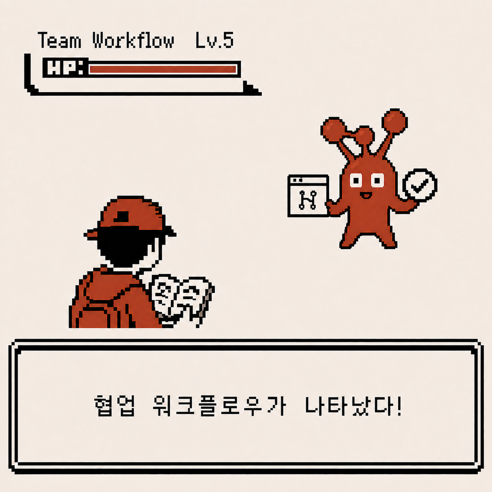
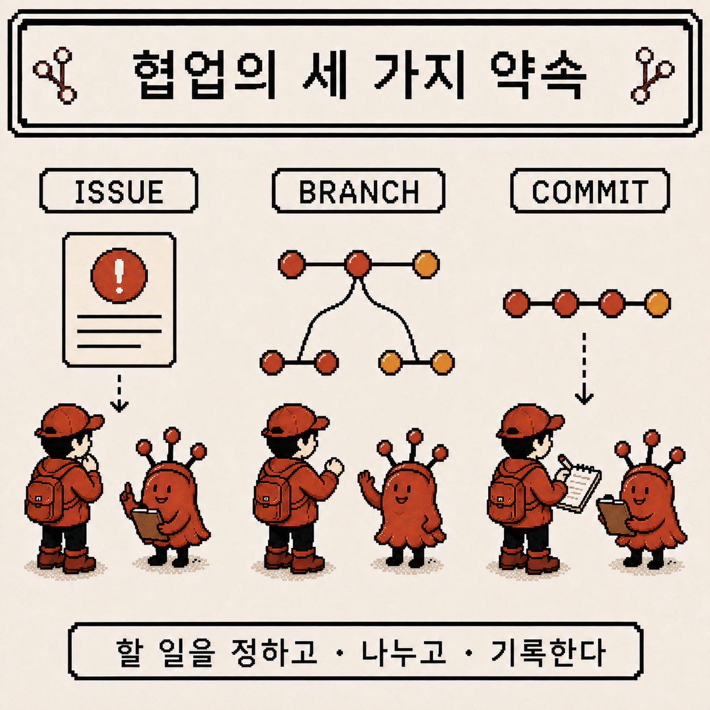
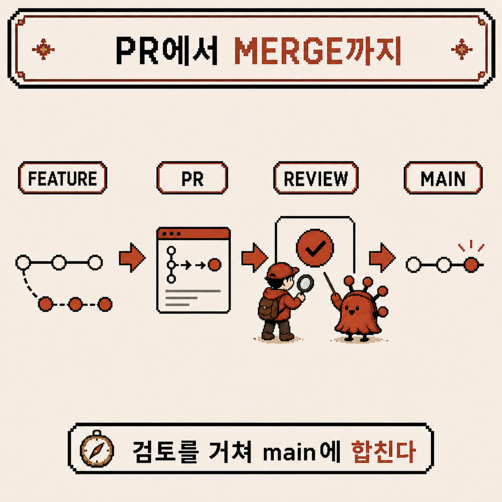
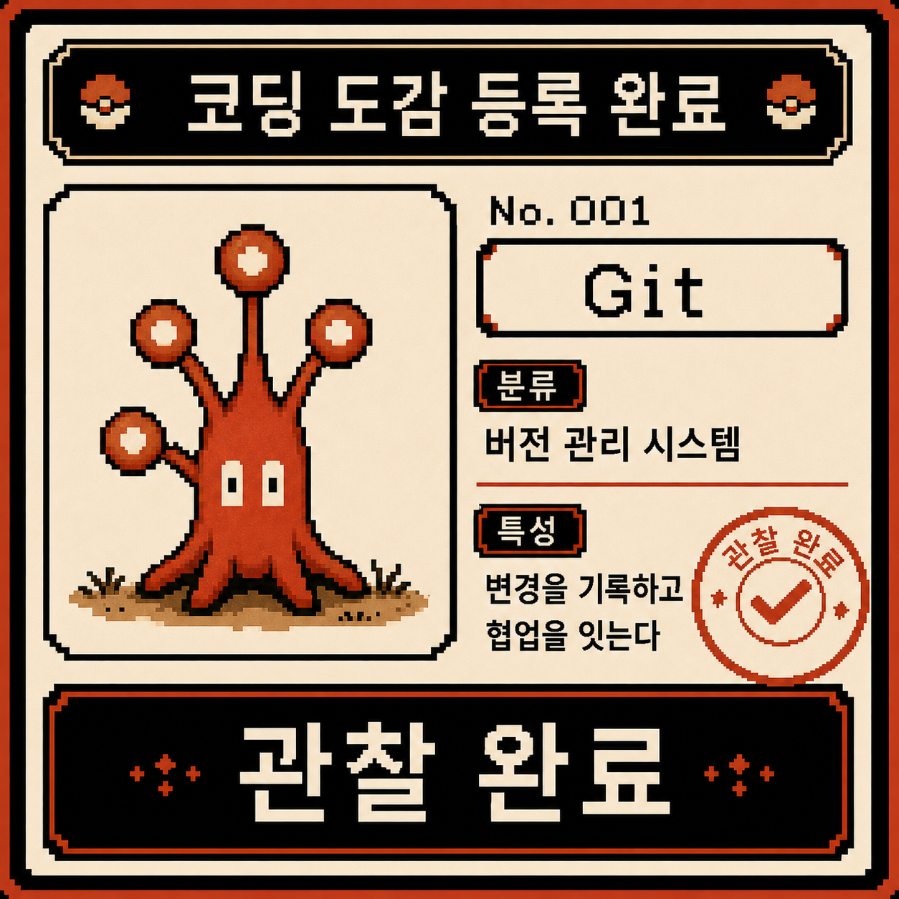
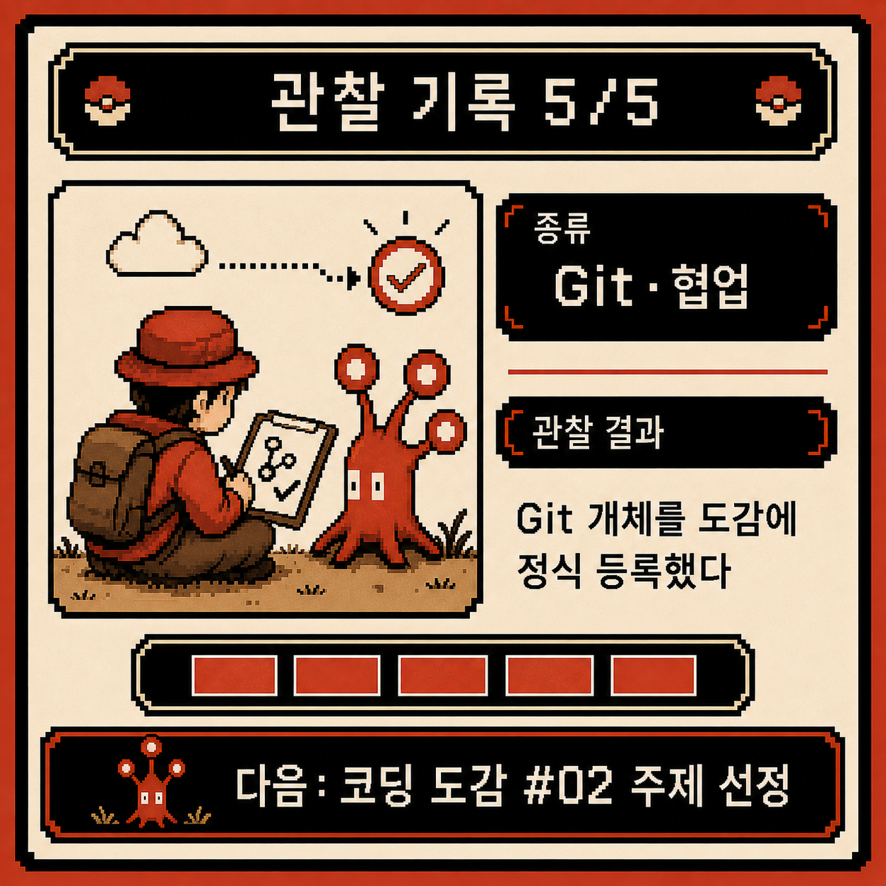

# 코딩 도감 #01 — 협업 워크플로우, 그리고 Git 등록 완료

지난 네 번의 관찰로 commit, branch, merge, 되돌리기, merge conflict, 원격 저장소, rebase까지 Git의 주요 도구를 거의 다 마주쳤다. 이번이 Git 개체의 마지막 관찰이다. 이 도구들이 실제 팀에서 어떻게 하나의 흐름으로 이어지는지 보고, Git을 코딩 도감에 정식으로 등록할 차례다.



---

## 개체 정보

- 이름: 협업 워크플로우 (Issue → Branch → Commit → PR → Review → Merge)
- 분류: 팀 단위 Git 작업 절차
- 출현 빈도: 매우 높음 (팀 프로젝트라면 예외 없이 등장)
- 위험도: ⚠️⚠️ (절차를 건너뛰면 지금까지 배운 도구들이 전부 뒤엉킴)

---

## 처음 만났을 때의 인상

협업 워크플로우를 처음 접했을 땐 이런 느낌이었다.

- 그냥 코드 고쳐서 `main`에 바로 올리면 되는데 왜 이렇게 절차가 많지?
- Issue는 버그 리포트 게시판 같은 건가 싶었다
- PR을 처음 열었을 때, 리뷰어가 뭘 보는 건지도 모른 채 그냥 승인을 기다렸다

혼자 작업할 땐 전혀 필요 없어 보였던 것들이, 사람이 늘어나자마자 전부 이유가 있는 절차였다는 걸 알게 됐다.

---

## 관찰 1 — 협업의 세 가지 약속: Issue, Branch, Commit

가장 먼저 정리한 건 팀이 같은 저장소를 쓰면서 부딪히지 않으려면 세 가지를 지켜야 한다는 것이었다.



- **Issue**: 할 일을 먼저 글로 정한다. "무엇을, 왜" 하는지가 여기 남는다
- **Branch**: Issue 하나당 브랜치 하나. 2주차에 배운 것처럼 각자의 평행세계에서 작업한다
- **Commit**: 작업 단위를 잘게 나눠 기록한다. 나중에 되돌리기(3주차)가 필요할 때 이 단위가 곧 안전망이다

혼자 쓸 땐 귀찮게만 느껴졌던 절차가, 여러 명이 동시에 같은 코드를 건드리는 상황에서는 "누가 무엇을 왜 하고 있는지"를 알려주는 최소한의 장치였다.

---

## 관찰 2 — PR에서 Merge까지, 검토를 거쳐 합류한다

각자 브랜치에서 작업을 마치면, 곧바로 `main`에 merge하지 않고 Pull Request(PR)를 연다.



```
feature 브랜치에서 작업 & commit
        │
        ▼
PR 열기 (변경 내용을 리뷰어에게 제안)
        │
        ▼
Review (다른 사람이 코드를 확인하고 의견을 남김)
        │
        ▼
승인되면 main으로 merge
```

PR은 결국 4주차에 본 rebase와 merge의 실전 사용처였다. 내 브랜치를 리뷰 전에 깔끔하게 정리하고 싶으면 rebase, 이미 다른 사람이 리뷰 중인 PR이면 함부로 rebase하지 않고 추가 commit이나 merge로 이어간다 — 지난주에 정리한 "황금률"이 여기서 그대로 적용됐다.

---

## 관찰 3 — 다섯 번의 관찰이 결국 하나의 흐름이었다

여기까지 오고 나니, 지난 5주가 각각 따로 배운 게 아니라 전부 이 워크플로우 하나를 위한 부품이었다는 걸 알게 됐다.

- Issue로 할 일을 정하고, branch로 나눠 작업한다 (1~2주차)
- 작업 중 실수하면 되돌리고, 다른 사람과 같은 코드를 건드리면 conflict를 해결한다 (3주차)
- 완성되면 원격에 push하고, 필요하면 rebase로 이력을 정리한다 (4주차)
- PR을 열어 리뷰받고, 승인되면 main에 merge한다 (이번 주)

Git 명령어를 하나씩 배울 땐 각각 독립된 도구처럼 느껴졌는데, 협업 워크플로우 안에 놓고 보니 전부 "여러 사람이 하나의 이력을 안전하게 함께 만드는" 목적으로 이어져 있었다.

---

## 요약 정리

- 협업은 Issue(할 일 정의) → Branch(분리) → Commit(기록)의 세 가지 약속에서 시작한다
- 작업이 끝나면 곧장 merge하지 않고 PR을 열어 Review를 거친다
- PR 전 정리는 rebase, PR이 열린 뒤에는 merge — 지난주 황금률이 여기서 실전에 쓰인다
- 지금까지의 모든 관찰(commit, branch, merge, 되돌리기, conflict, 원격, rebase)이 결국 이 워크플로우 하나로 수렴한다

---

## 코딩 도감 메모

5주 전, Git은 그냥 명령어를 외워서 쓰는 도구였다. 이제는 기록(commit)을 남기고, 평행세계(branch)를 만들고, 다시 합치고(merge), 실수를 되돌리고(reset/revert/restore), 충돌을 해결하고(conflict), 원격과 대화하고(fetch/pull/push), 이력을 다시 쌓고(rebase), 마지막으로 팀과 함께 검토받는(PR/review) 하나의 완결된 흐름으로 보인다.

그래서 이번엔 특별히, Git 개체를 코딩 도감에 정식으로 등록한다.



다음 개체 선정은 이제부터 시작이다. 코딩 도감 #02는 무엇을 관찰하게 될까.


