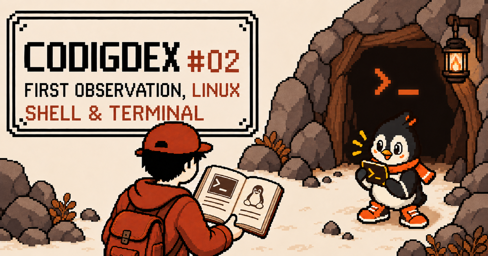
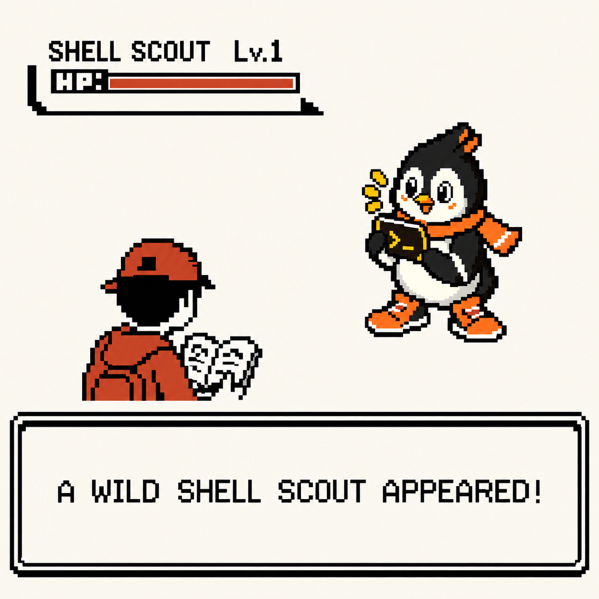
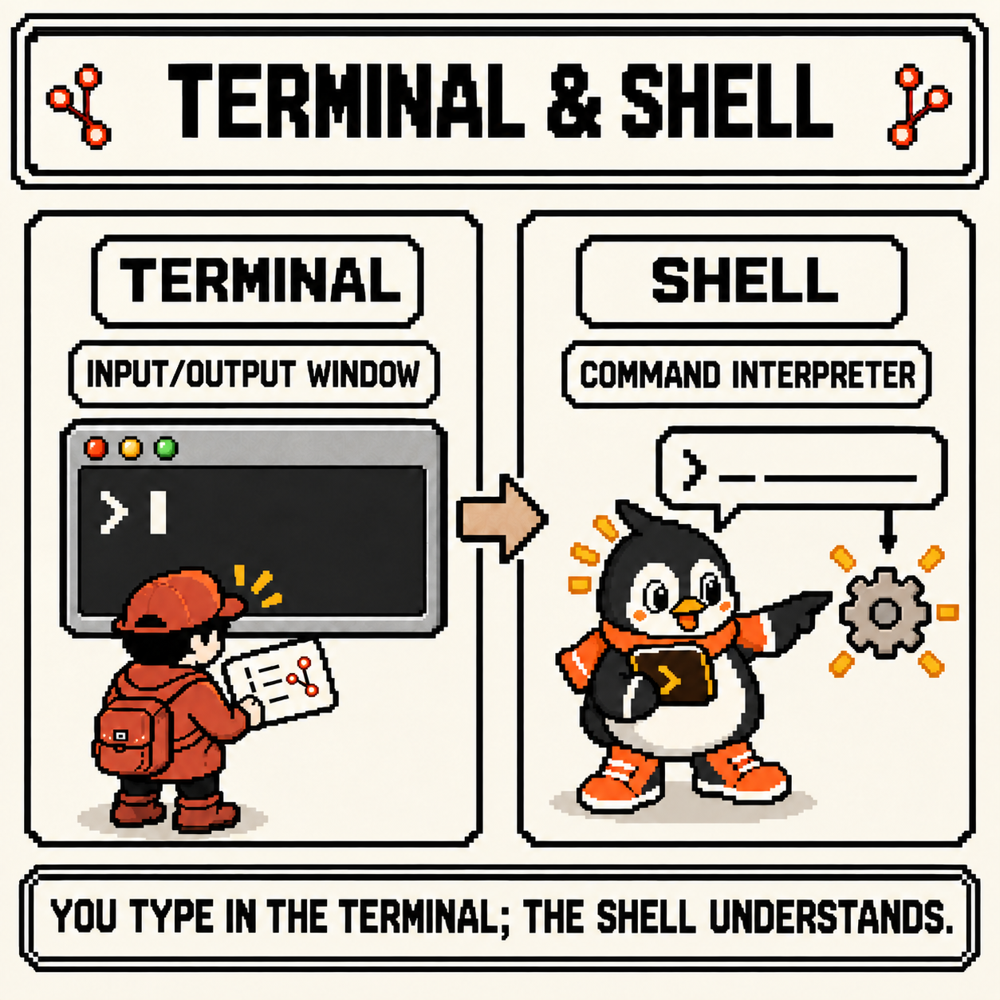
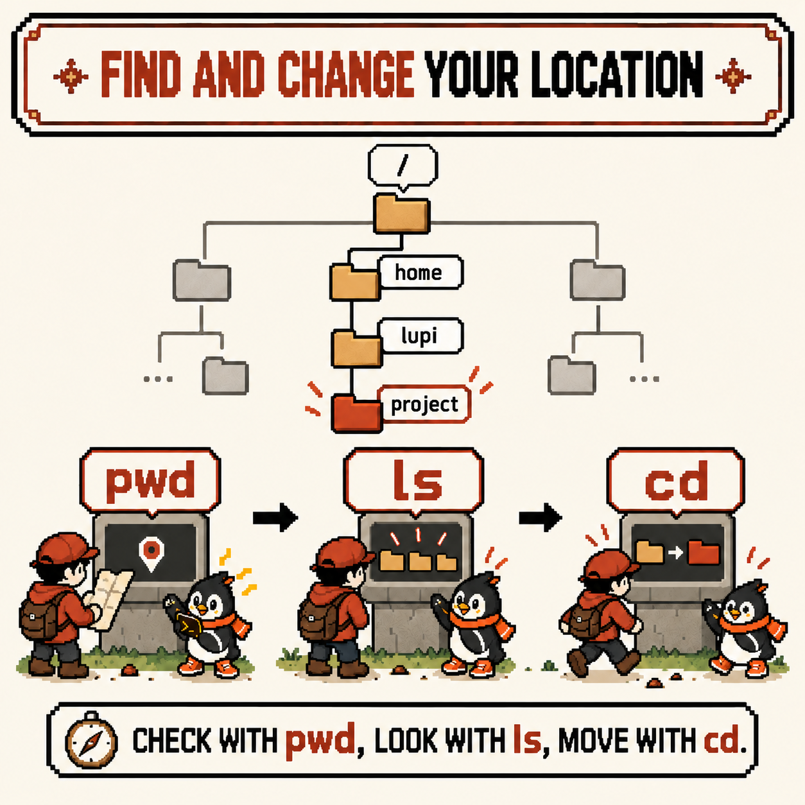
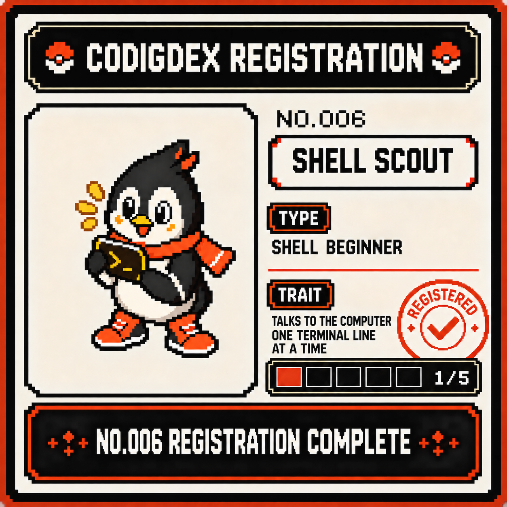

# Codigdex #02 — First Encounter with Linux: The Shell, the Terminal, and pwd/ls/cd



All five slots of the Git chapter are filled. Looking back, though, `git add`, `git commit`, and `git push` were all typed into the same place: that dark window with the blinking cursor.

This chapter observes what's on the other side of that window. Codigdex #02 is Linux, and its first specimen is the **shell** — the thing that takes your commands and runs them. Time to record the first specimen spotted at the mouth of the Shell Cave.



---

## Specimen info

- Dex number: NO.006 Shell Scout
- Name: The shell and the terminal — `pwd`, `ls`, `cd`
- Classification: Shell beginner type
- Encounter rate: Very high (shows up everywhere: servers, containers, CI logs)
- Danger level: ⚠️ (the three commands themselves are harmless, but type the next command without knowing where you're standing and it runs in the wrong place)

---

## First impression

Open a terminal for the first time, and these questions come up right away.

- Terminal, shell, console, command prompt… are these all the same thing?
- What is something like `lupi@codigdex:~$` actually telling me?
- A file explorer shows me the folders — so how do I know where I am in here?

Before memorizing any commands, I decided to sort out these questions one at a time.

---

## Observation 1 — the terminal is the window, the shell is the interpreter

The first thing to separate was that the **terminal** and the **shell** are two different programs.



- **Terminal**: the **window** that takes the characters you type and shows the results on screen. What most of us use today is a terminal emulator — programs like GNOME Terminal, Terminal or iTerm2 on macOS, and Windows Terminal
- **Shell**: the program that reads each line coming in from the terminal, **interprets it, and runs it**. `bash` and `zsh` are the best-known ones

Here's the flow when you type one line.

```text
Type one line on the keyboard
        │
        ▼
Terminal (receives the characters and hands them to the shell)
        │
        ▼
Shell (interprets the command and runs the program)
        │
        ▼
The output comes back and is shown in the terminal
```

That's why you can switch shells inside the same terminal window, or open the same shell in several terminals. The terminal is the outside; the shell is the one that actually understands what you say. It's also why the Shell Scout's trait is "talks to the computer one terminal line at a time": you type into the terminal, but it's the shell that listens.

You can check which shell is set as your default like this.

```bash
echo $SHELL
```

It prints the path to a shell program, such as `/bin/bash` or `/bin/zsh`. This value is your default login shell, so if you started a different shell inside the terminal, it may not match the one you're using right now. The examples in this post assume `bash` on Linux; in `zsh`, macOS's default shell, `pwd`, `ls`, and `cd` behave the same way.

The prompt comes from the shell too. Here's a common `bash` prompt taken apart.

```text
lupi@codigdex:~$
```

- `lupi`: the current user name
- `codigdex`: the computer (host) name
- `~`: the current location. `~` is shorthand for your home directory
- `$`: marks a regular user. As the administrator (root), it usually turns into `#`

The prompt's look varies by distribution and configuration, but it commonly tells you who you are, on which computer, and where you're standing.

---

## Observation 2 — the shell is always standing somewhere

The second thing I pinned down was that the shell always has a **current location**.



On Linux, files and directories are connected in one big tree that starts at `/` (the root). The shell stands on one branch of that tree, and that spot is called the **working directory**. Any command that doesn't name a location runs relative to this spot.

A file explorer shows your location in the address bar at the top of the window, but in the shell you have to ask. The three commands for asking are the core of this specimen.

- `pwd`: check where you're standing (**p**rint **w**orking **d**irectory)
- `ls`: look around at what's here (**l**i**s**t)
- `cd`: move somewhere else (**c**hange **d**irectory)

First, check where you are.

```bash
pwd
```

```text
/home/lupi
```

This output is an example; the user name and path differ from one environment to the next. A freshly opened terminal usually starts in your home directory, and the `~` in the prompt is shorthand for exactly this path.

Next, look around.

```bash
ls
ls -a
ls -l
```

- `ls`: shows the names of the files and directories in the current directory
- `ls -a`: shows everything, including **hidden files** whose names start with `.`. Shell configuration files like `.bashrc` show up here
- `ls -l`: shows one entry per line, with details such as permissions, owner, size, and modification time

When you run `ls -a`, `.` and `..` show up in the list too. `.` is the directory you're in, and `..` is its parent, one level up. These two come right back in the next observation's `cd ..`.

Strings like `drwxr-xr-x` at the start of each `ls -l` line will get a proper reading in week 3's observation of permissions. For now, I'm filing it away as "the detailed view."

---

## Observation 3 — cd lives inside the shell

Location checked, surroundings surveyed — now it's time to move.

```bash
cd ~/project   # move into project under your home (assuming it exists)
pwd            # confirm the move → /home/lupi/project
cd ..          # go up one level, to the parent directory
cd             # with no argument, go back to your home directory
cd -           # return to the directory you were in just before
```

In `cd ~/project`, it's also the shell that turns `~` into `/home/lupi`. Before running a command, the shell expands markers like `~` into real paths and then passes them along. This is where it really sank in that the shell doesn't just relay characters — it interprets them.

Observing these three commands, one interesting difference turned up. `ls` is a separate executable file on disk, but `cd` is a **builtin** — a command built into the shell itself. You can check with `type`.

```bash
type cd
type pwd
type ls
```

In `bash`, `type cd` and `type pwd` report that they're builtins, as in `cd is a shell builtin` and `pwd is a shell builtin`. `type ls` shows an executable path like `/usr/bin/ls`, or, depending on the distribution, an alias such as `ls --color=auto`.

The reason `cd` has to live inside the shell is that the current location is the shell's own state. When the shell runs an external program like `ls`, it starts a separate new process, and however much that process changes its own location, the location of its parent — the shell — stays put. So moving "the spot where the shell is standing" is a job the shell has to do itself, which is why `cd` is built in.

---

## Summary

- The terminal is the window that shows input and output; the shell is the program that interprets and runs each line
- The prompt comes from the shell and tells you the user, the host, and the current location
- The shell always stands on one spot in the filesystem tree (the working directory), and commands run relative to that spot
- Check your location with `pwd`, look around with `ls` (`-a`, `-l`), and move with `cd`
- `cd` changes the shell's own location, so it's a shell builtin

---

## Codigdex notes

Through the whole Git chapter, I thought that dark window was just "the place where you type commands." Looking closer, there was a window (the terminal) and an interpreter (the shell), and the shell was always standing somewhere in the filesystem, waiting for me to say something. `pwd`, `ls`, and `cd` turned out to be the most basic conversation you can have with that interpreter: "Where are we?", "What's here?", and "Let's go over there."

The next observation meets paths and files. The paths I used today, like `cd ~/project` and `cd ..`, split into absolute paths that start at `/` and relative paths measured from where you're standing — and after that, it's on to actually handling files with `mkdir`, `cp`, `mv`, `rm`, and `find`.

Before that, the first specimen of the Linux chapter goes into the Codigdex. **NO.006 Shell Scout** — talks to the computer one terminal line at a time. The first of the Linux chapter's five slots is filled.


