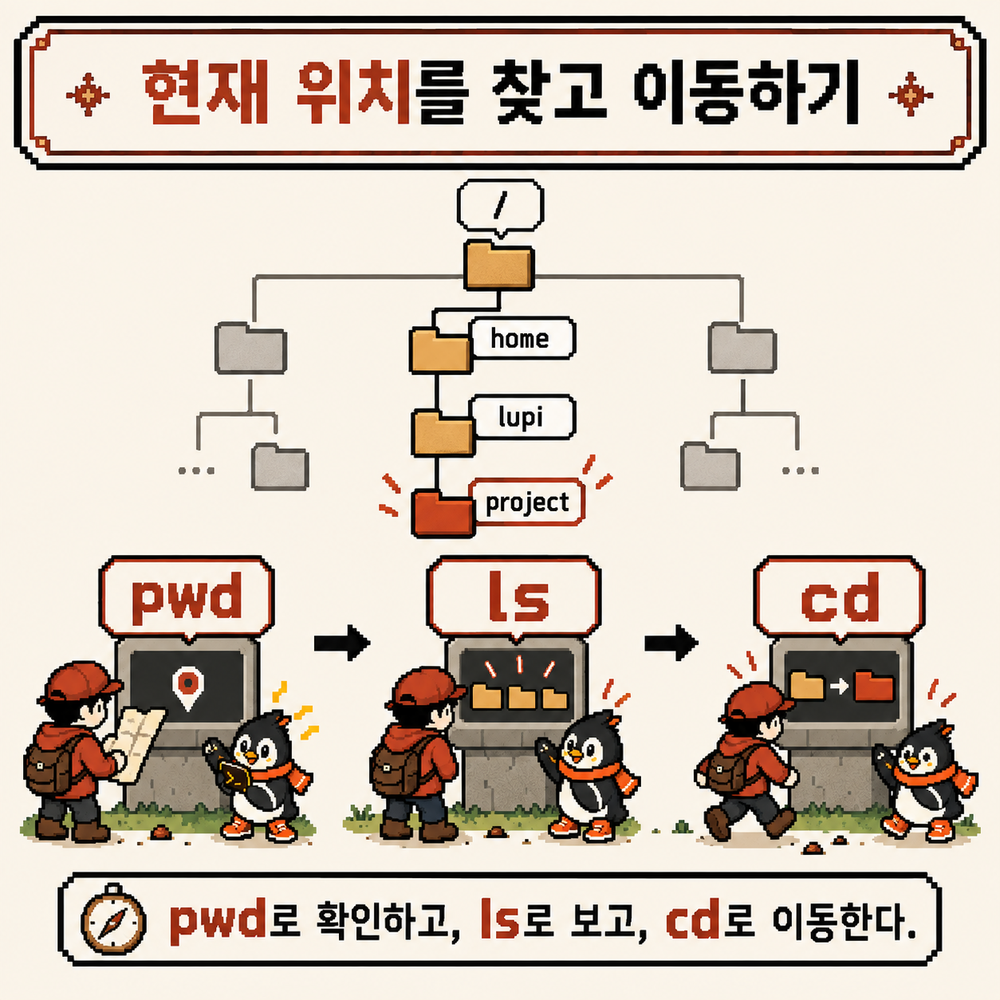

# 코딩 도감 #02 — Linux 첫 조우: 셸과 터미널, 그리고 pwd·ls·cd


Git 챕터 다섯 칸을 모두 채웠다. 그런데 돌아보면 `git add`, `git commit`, `git push`는 전부 같은 곳에서 입력했다. 깜빡이는 커서가 있는 그 검은 창이다.

이번 챕터에서는 그 창 너머를 관찰한다. 코딩 도감 #02는 Linux이고, 첫 번째 개체는 명령을 받아 실행해 주는 **셸**이다. 셸 동굴 입구에서 처음 마주친 개체부터 기록해 본다.


---

## 개체 정보

- 도감 번호: NO.006 셸 탐험가
- 이름: 셸(Shell)과 터미널 — `pwd`, `ls`, `cd`
- 분류: 셸 입문형
- 출현 빈도: 매우 높음 (서버, 컨테이너, CI 로그 어디서든 등장)
- 위험도: ⚠️ (세 명령 자체는 안전하지만, 지금 어디 서 있는지 모른 채 다음 명령을 치면 엉뚱한 곳에서 실행됨)

---

## 처음 만났을 때의 인상

터미널을 처음 열면 이런 질문부터 떠오른다.

- 터미널, 셸, 콘솔, 명령 프롬프트… 다 같은 말인가?
- `lupi@codigdex:~$` 같은 글자는 대체 뭘 말해 주는 걸까?
- 파일 탐색기에서는 폴더가 눈에 보이는데, 여기서는 내가 지금 어디 있는지 어떻게 알지?

명령어를 외우기 전에, 이 질문들부터 하나씩 정리해 보기로 했다.

---

## 관찰 1 — 터미널은 창이고, 셸은 통역사다

가장 먼저 구분해야 할 건 **터미널**과 **셸**이 서로 다른 프로그램이라는 점이었다.


- **터미널(Terminal)**: 글자를 입력받고 결과를 화면에 보여 주는 **창**이다. 지금 쓰는 건 대부분 터미널 에뮬레이터로, GNOME Terminal, macOS의 Terminal·iTerm2, Windows Terminal 같은 프로그램이 여기에 해당한다
- **셸(Shell)**: 터미널로 들어온 한 줄을 읽고 **해석해서 실행하는** 프로그램이다. `bash`, `zsh`가 대표적이다

한 줄을 입력했을 때의 흐름을 그려 보면 이렇다.

```text
키보드로 한 줄 입력
        │
        ▼
터미널 (글자를 받아 셸에 전달)
        │
        ▼
셸 (명령을 해석하고 프로그램을 실행)
        │
        ▼
실행 결과가 다시 터미널 화면에 출력
```

그래서 같은 터미널 창 안에서 셸을 바꿀 수도 있고, 같은 셸을 여러 터미널에서 띄울 수도 있다. 터미널은 겉모습, 셸은 실제로 말을 알아듣는 쪽이다. 셸 탐험가의 특성이 "터미널 한 줄로 컴퓨터에 말을 건다"인 것도 이 구조 때문이다. 말은 터미널에 치지만, 알아듣는 건 셸이다.

지금 기본으로 지정된 셸은 이렇게 확인할 수 있다.

```bash
echo $SHELL
```

`/bin/bash`나 `/bin/zsh`처럼 셸 프로그램의 경로가 출력된다. 이 값은 로그인할 때 쓰는 기본 셸이라, 터미널 안에서 다른 셸을 따로 실행했다면 지금 쓰는 셸과 다를 수 있다. 이 글의 예시는 Linux의 `bash` 기준이며, macOS 기본 셸인 `zsh`에서도 `pwd`·`ls`·`cd`는 똑같이 동작한다.

프롬프트도 셸이 띄우는 것이다. 흔히 보이는 `bash` 프롬프트를 뜯어 보면 이렇다.

```text
lupi@codigdex:~$
```

- `lupi`: 현재 사용자 이름
- `codigdex`: 컴퓨터(호스트) 이름
- `~`: 현재 위치. `~`는 내 홈 디렉터리를 줄여 쓴 표시다
- `$`: 일반 사용자라는 표시. 관리자(root)일 때는 보통 `#`으로 바뀐다

프롬프트 모양은 배포판과 설정마다 다르지만, 흔히 "누가, 어느 컴퓨터의, 어디에 서 있는지"를 알려 준다.

---

## 관찰 2 — 셸은 항상 "어딘가"에 서 있다

두 번째로 정리한 건, 셸에게는 언제나 **현재 위치**가 있다는 점이었다.



Linux의 파일과 디렉터리는 `/`(루트)에서 시작하는 하나의 큰 나무 구조로 이어져 있다. 셸은 이 나무의 어느 한 가지 위에 서 있고, 이 위치를 **현재 작업 디렉터리(working directory)** 라고 부른다. 따로 위치를 지정하지 않은 명령은 모두 이 자리를 기준으로 실행된다.

파일 탐색기에서는 창 위쪽 주소 표시줄이 현재 위치를 보여 주지만, 셸에서는 직접 물어봐야 한다. 그때 쓰는 세 가지 명령이 이번 개체의 핵심이다.

- `pwd`: 지금 어디 서 있는지 확인한다 (**p**rint **w**orking **d**irectory)
- `ls`: 지금 자리에 무엇이 있는지 둘러본다 (**l**i**s**t)
- `cd`: 다른 자리로 옮겨 간다 (**c**hange **d**irectory)

먼저 위치를 확인한다.

```bash
pwd
```

```text
/home/lupi
```

출력은 예시이며, 사용자 이름과 경로는 환경마다 다르다. 터미널을 막 열었다면 보통 홈 디렉터리에서 시작하고, 프롬프트의 `~`가 바로 이 경로를 줄여 쓴 것이다.

다음은 주변을 둘러본다.

```bash
ls
ls -a
ls -l
```

- `ls`: 현재 디렉터리의 파일과 디렉터리 이름을 보여 준다
- `ls -a`: 이름이 `.`으로 시작하는 **숨김 파일**까지 모두 보여 준다. `.bashrc` 같은 셸 설정 파일이 여기서 드러난다
- `ls -l`: 한 줄에 하나씩, 권한·소유자·크기·수정 시각 같은 자세한 정보를 함께 보여 준다

`ls -a`를 실행하면 목록에 `.`과 `..`도 함께 나온다. `.`은 지금 있는 디렉터리 자신, `..`은 한 단계 위의 부모 디렉터리다. 이 두 표시는 다음 관찰의 `cd ..`에서 바로 쓰인다.

`ls -l` 결과의 맨 앞에 보이는 `drwxr-xr-x` 같은 문자열은 3주차 권한 관찰에서 자세히 읽어 볼 예정이다. 지금은 "자세히 보기 옵션" 정도로 기억해 둔다.

---

## 관찰 3 — cd는 셸 안에 들어 있는 명령이다

위치를 확인하고 둘러봤으니, 이제 움직일 차례다.

```bash
cd ~/project   # 홈 아래 project 디렉터리로 이동 (있다고 가정)
pwd            # 이동했는지 확인 → /home/lupi/project
cd ..          # 한 단계 위, 부모 디렉터리로 이동
cd             # 인자 없이 실행하면 홈 디렉터리로 이동
cd -           # 직전에 있던 디렉터리로 되돌아감
```

`cd ~/project`에서 `~`를 `/home/lupi`로 바꿔 주는 것도 셸이다. 셸은 명령을 실행하기 전에 `~` 같은 표시를 실제 경로로 펼친 다음 넘긴다. 셸이 단순히 글자를 전달하는 게 아니라 "해석"한다는 말이 여기서 실감이 났다.

그런데 이 세 명령을 관찰하다 보니 흥미로운 차이가 하나 보였다. `ls`는 디스크에 따로 있는 실행 파일이지만, `cd`는 셸 자체에 들어 있는 **내장 명령(builtin)** 이다. `type`으로 확인할 수 있다.

```bash
type cd
type pwd
type ls
```

`bash`에서 `type cd`와 `type pwd`는 `cd is a shell builtin`, `pwd is a shell builtin`처럼 내장 명령이라고 알려 준다. `type ls`는 `/usr/bin/ls` 같은 실행 파일 경로나, 배포판에 따라 `ls --color=auto` 같은 별칭(alias)을 보여 준다.

`cd`가 셸 안에 있어야 하는 이유는 현재 위치가 셸 자신의 상태이기 때문이다. 셸은 `ls` 같은 외부 프로그램을 실행할 때 별도의 프로세스를 새로 띄우는데, 그 프로세스가 자기 위치를 아무리 바꿔도 부모인 셸의 위치는 바뀌지 않는다. 그래서 "셸이 서 있는 자리"를 옮기는 일은 셸이 직접 해야 하고, `cd`는 셸에 내장되어 있다.

---

## 요약 정리

- 터미널은 입력과 출력을 보여 주는 창이고, 셸은 그 한 줄을 해석해서 실행하는 프로그램이다
- 프롬프트는 셸이 띄우는 것으로, 사용자·호스트·현재 위치를 알려 준다
- 셸은 항상 파일시스템 트리의 한 자리(현재 작업 디렉터리)에 서 있고, 명령은 그 자리를 기준으로 실행된다
- `pwd`로 위치를 확인하고, `ls`(`-a`, `-l`)로 둘러보고, `cd`로 이동한다
- `cd`는 셸의 위치를 바꾸는 명령이라 셸 내장 명령이다

---

## 코딩 도감 메모

Git 챕터 내내 쓰던 그 검은 창은 그냥 "명령을 치는 곳"인 줄 알았다. 들여다보니 창(터미널)과 통역사(셸)가 따로 있었고, 셸은 늘 파일시스템 어딘가에 서서 내 말을 기다리고 있었다. `pwd`, `ls`, `cd`는 그 통역사에게 "지금 어디야?", "여기 뭐가 있어?", "저기로 가자"라고 묻는 가장 기본적인 대화였다.

다음 관찰에서는 경로와 파일을 만난다. 오늘 `cd ~/project`나 `cd ..`처럼 써 본 경로가 `/`에서 시작하는 절대 경로와 현재 위치를 기준으로 하는 상대 경로로 어떻게 나뉘는지, 그리고 `mkdir`, `cp`, `mv`, `rm`, `find`로 파일을 실제로 다루는 법을 관찰할 예정이다.

그 전에, Linux 챕터의 첫 개체를 코딩 도감에 등록한다. **NO.006 셸 탐험가** — 터미널 한 줄로 컴퓨터에 말을 건다. Linux 챕터 다섯 칸 중 첫 칸이 채워졌다.


